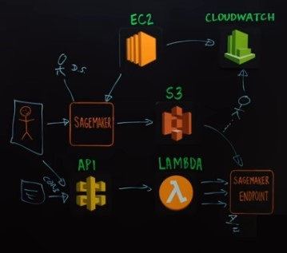

<h1>AWS</h1>


<h2>Flask and AWS</h2>


- I can use either Flask SQLAlchemy or FlaskRedis to read and write to and from a database.

- I can use [AWS RDS](https://aws.amazon.com/rds/) and select MySQL engine and select dev/test for now and then move to [Amazon Aurora](https://aws.amazon.com/rds/aurora/machine-learning/) for production

- Elastic Beanstalk Environment for deploying the app using a CLI

- [Amazon Web Services’ Lambda](https://aws.amazon.com/lambda/) containerizes your code and auto-scales those containers for you, with zero administration required from developers. For clarity, “serverless” means the developer does not have to think about servers, even though they exist. AWS handles them.

- [Amazon DynamoDB](https://aws.amazon.com/dynamodb/) looks like a good option to store the text data but look into it further.

- [AWS Elastic Beanstalk](https://aws.amazon.com/elasticbeanstalk/) is an easy-to-use service for deploying and scaling web applications


<h2>AWS Elastic Beanstalk</h2>


- A solution like Beanstalk will take care of the scaling of your web servers by putting a reverse proxy in front of your application servers. It will easily manage requests in the order of early thousands concurrently and after that your load balancers will kick in rotating the user’s requests to other application servers according to the auto scaling policy you have mentioned in the configuration settings while setting your application

- Lambda is simpler and less expensive, while Elastic Beanstalk lets you run full applications and gives you control over their environment.

- With Elastic Beanstalk, you have access to a Platform as a Service (PaaS), and you can manage some aspects of the infrastructure. Developers can create, test, and deploy applications on the platform. You don’t have to deal with provisioning, load balancing, or scaling. Elastic Beanstalk supports many server environments, including Apache HTTP Server, Nginx, Microsoft IIS, and Apache Tomcat. It has strong support for Docker containers, allowing easy deployment of applications.

- Developers uploading to Lambda don’t have to deal with their code’s environment. It’s a “serverless” service which lets outside code or events invoke functions. Lambda doesn’t store data, but it allows access to other services which do. The thing which really makes Lambda attractive is that you pay nothing except when you actually run code on it. You can pull compute-heavy pieces out of your applications and deploy them on Lambda for a very low cost. You can’t run full-blown applications on Lambda, but AWS Step Functions implement a state machine, letting you invoke a series of Lambda functions and handle error conditions. Lambda functions can serve as a backend to an application running elsewhere.

- Elastic Beanstalk pricing is more complicated. There’s no charge for using Elastic Beanstalk as such, but you pay for the AWS resources that store and run your code. The Free Usage Tier, which is available for 12 months, may be enough to run many applications that don’t get heavy traffic. Applications will usually run on EC2, which is where you pay for instances, load balancing, and data transfers. You can pay for on-demand, reserved, or spot instances, or you can request a dedicated server. On-demand works best if your requirements vary over time, and spot instances can save money if you’re flexible about when your applications run.

- Lambda lets you define functions which are available at any time, but it doesn’t give you any persistent storage or state information. This isn’t as limiting as it may sound, though. You can add S3 storage or a database as a backend. You can offload processing tasks from a front-end application onto Lambda. AWS Step Functions allow the implementation of simple workflows. Amazon API gateway provides a backplane for building an API using Lambda functions.

- Lambda does have some hard limits. The request body payload can’t be more than 6 MB. The duration of a request can’t exceed 300 seconds. This makes it unsuitable for passing large blocks of data or for functions that wait a long time, but there are often workarounds. There are also deployment limits; a deployment package can’t exceed 50 MB. Lambda code can include existing libraries, but very large libraries could be a problem.

- If customization of the application’s environment is necessary, Elastic Beanstalk offers a lot of value. Anything that’s concerned with the details of security, resource allocation, auto-scaling, and log customization needs more flexibility than Lambda offers.

- The whole application doesn’t need to be on the application platform. A hybrid approach, with functions on Lambda doing the bulk of the computing, will let you run a lightweight application that doesn’t require a huge amount of server power. When making the choice of AWS Lambda vs. Elastic Beanstalk, it isn’t necessarily an either-or choice.

- AWS Lambda will let you slice your apps as granularly as you like. Can’t do that with Elastic Beanstalk. A Lambda function can be a single API endpoint, a collection of endpoints, or an entire app backend.

- AWS Lambda lets you easily set up triggers via Amazon’s API Gateway, DynamoDB, and S3 services.

I feel that any Application deployed in production should be made such that it stands out on the following 3 features:

- Scalability
- High Availability(Resiliency)
- Maintainability

- For businesses new to AWS or new to the containerization concept, just getting started with Docker, or developing new applications, Elastic Beanstalk may be the best approach to support Docker containers. Elastic Beanstalk offers a simple interface, allows Docker images to be pulled from public or private registries, and coordinates the deployment of multiple Docker containers to Amazon ECS clusters. Elastic Beanstalk gives you less control over application scaling and capacity but makes deploying Docker containers on AWS ever so straightforward.

- In comparison to Elastic Beanstalk, Elastic Container Service (relies on [AWS Fargate](https://aws.amazon.com/fargate/)) provides greater control over application architectures and orchestration of Docker containers. You specify the size and number of cluster nodes and determine if auto-scaling should be used. Elastic Container Service uses tasks to launch Docker containers. A task includes the container definition, providing the ability to group containers in sets that launch together then terminate simultaneously. ECS provides significantly greater flexibility and customization in scheduling and CPU and memory utilization. In addition, ECS does not require special integration efforts to work with many other AWS services.


<h2>Amazon Textract</h2>


With synchronous processing, Amazon Textract can analyze single-page documents for applications where latency is critical. Amazon Textract also provides asynchronous operations to extend support to multipage documents.

If you're building an application to index documents that have various numbers of pages, you might choose to send the same single-page form to the asynchronous call so that all of your documents can be processed in the same workflow.

For asynchronous operations, you need to supply input documents in an Amazon S3 bucket.


<h2>Amazon Lambda</h2>


When you invoke a function, you can choose to invoke it synchronously or asynchronously. With synchronous invocation, you wait for the function to process the event and return a response. With asynchronous invocation, Lambda queues the event for processing and returns a response immediately.

Below is the architecture I think is the best for my application but I don't think I am going to build it just yet:


<h2>Amazon Web Services: Exploring Business Solutions</h2>


I can train and deploy machine learning model using Amazon SageMaker.

I can use customer feedback and get the summaries that perform bad and use the SageMaker labelling and Amazon Mechanical Turk to rate the machine learning summaries and once I get enough summaries I can retrain the network and deploy.

_Amazon Big Data Platforms_

1. Redshift: Large data storage; Cost effective storage for business intelligence data and management.
2. Kinesis: Streaming Data Service; Data highway for stores, applications and analysis solutions.
3. DynamoDB: NoSQL database; Captures data in unstructured tables.
4. Elasticsearch Service: Cross-source search engine; Gives access to all data being captured from all sources.
5. EC2: Hosted servers; Host websites, applications and services.
6. EMR (Elastic Map Reduce): Elastic Cluster Computing solution; Used for risk modeling, predictive analysis and ad targeting
7. QuickSight: Business intelligence tool; Build data visualizations to communicate data insight.

_AWS Storage Solutions_

- S3: Key data store for all working data
- Glacier: Archival data storage

Amazon RDS for structured data: Microsoft SQL, Oracle, Aurora, MySQL and PostgreSQL


<h2>Scaling on AWS for the First 10 Million Users</h2>


- High Availability
- Fail-over
- Redundancy


- Decompose into pieces so it scales independently.

- If your usage is such that you will be generating several TB (>5) of data in the first year or have an incredibly data-intensive workload... you might need NoSQL.


- When you have > 1000 users, go with Amazon RDS.

- Elastic load balancing creates highly scalable applications.

- Move static content from the web instance to Amazon S3 and Amazon CloudFront.
- Move dynamic content from the load balancer to CloudFront.
- Move session/state and DB caching to Amazon ElasticCache or Amazon DynamoDB.


- When you have 100 of 1000s of users, move services into their own tiers/modules. Treat each of these as 100% separate pieces of your infrastructure and scale them independently.


<h2>Deploying Cost-Effective Deep Learning Inference</h2>


- Amazon Elastic Inference: is suitable for GPU inference; Lowers inference cost; Match capacity to demand; Available between 1 to 32 TFLOPS per accelerator.

- You can prototype deployments with notebooks in local model and scale endpoints with low cost Elastic Inference Acceleration with SageMaker.

_How to choose among different Accelerators?_

- What is your target latency SLA for your application?
- What is the GPU memory requirement for your application?
- Start small and size up if you need more capacity.
- Input/Output data payload has an impact on latency.
- Convert to FP16 for lower latency and higher throughput.


<h2>Build, Train and Deploy Machine Learning Models on AWS with Amazon SageMaker</h2>


Interacting with SageMaker:


Built-in algorithms that is engineered different from a usual implementation with GPU support and scalability.


Automatic Model Tuning in SageMaker is used for hyper-parameter tuning using Bayesian Optimization.


<h2>AWS Essential Training for Architects</h2>


<h3>Clouds</h3>

__Cloud Services__

- IaaS
- PaaS
- SaaS


__Cloud Benefits__

- Minimum upfront investment
- Just in time infrastructure
- No long term contracts
- Scriptable Infrastructure
- Scaling Out / In (Horizontal Scaling) or Up / Down (Vertical Scaling) Resources with autoscaling and on demand scaling options
- Improved Development lifecycle
- High availability and disaster recovery benefits

<h3>Cloud Practices</h3>

__Design for failure__

- Avoid single point failure


__Implement elasticity__

There are a few methods typically used to achieve this scaling:
- Scale components on a regular fixed basis, for example, hourly, daily or weekly. This would work if an application has highly predictable traffic patterns
- Scale components in anticipation of an expected event.
- Set up monitoring certain metrics and scale in reaction to metrics rising above or falling below certain thresholds. For example, spikes in CPU utilization or network I/O.

Regardless of the method, in order to take full advantage of scaling:
- Application deployment process need to be automated.
- System configuration and application design must also be adjusted to accommodate scaling.

One of the keys to automating application processes is a concept referred to as _bootstrapping_. Bootstrapping refers to creating a self-sustaining start-up process that can run on its own. In the context of AWS, it typically means the process needed to get applications up and running on an EC2 instance.

__Optimize for performance__

_[Amazon CloudFront](https://aws.amazon.com/cloudfront/)_: is a fast content delivery network (CDN) service that securely delivers data, videos, applications, and APIs to customers globally with low latency, high transfer speeds, all within a developer-friendly environment.

_[Amazon CloudWatch](https://aws.amazon.com/cloudwatch/)_: is a monitoring and observability service built for DevOps engineers, developers, site reliability engineers (SREs), and IT managers. CloudWatch provides you with data and actionable insights to monitor your applications, respond to system-wide performance changes, optimize resource utilization, and get a unified view of operational health.

<h3>Keep things Secure</h3>

__The shared security model__

AWS works on what is referred to as a shared security model. This means the security responsibility is shared between the customer and Amazon.

Amazon provides security of the cloud whereas the customer provides security in the cloud.

_Shared Security Line for IaaS_:


_Shared Security Line for PaaS_:


_Shared Security Line for SaaS_:


__IAM: Groups, roles and permissions__

_IAM Users_:


_IAM Groups_:


_IAM Roles_:


- Similar to a user
- Assumed by resources requiring the role
- No login credentials
- No direct static access keys associated
- Allow temporary security credentials
- An alternative to credential sharing
- No need to define permissions and manage each entity

__Security groups__


Use security groups to control the inbound and outbound traffic to AWS resources and follow the principle of least privilege when defining your rules.

__VPC__

_Amazon Virtual Private Cloud_ or VPC enables AWS resources to be launched into a virtual network defined by you, the customer. This virtual network resembles a traditional network that might be created in a private data center but with the benefits that come with the scalable infrastructure within AWS.

- Logically isolate to only one AWS account
- Not automatically addressable via the public internet
- Private and Public Interface control
- Both inbound and outbound traffic can be controlled
- Multiple IP addresses can be assigned
- Elastic interface networks can be assigned
- VPN connection

<h3>Designing for Failure</h3>

__Regions and Availability Zones__

AWS regions are distributed worldwide and categorized by five primary land areas: North America, South America, Europe, Middle East and Africa, and Asia Pacific.

Availability Zones are distinct, physical locations that are engineered to be insulated from failures from other Availability Zones and provide inexpensive, low latency network connectivity to other Availability Zones in the same region.

Use multiple regions and availability zones to achieve high availability, fault tolerance and disaster recovery requirements.

__The Amazon Machine Image (AMI)__

AMI is a packaged environment containing a software stack, along with all of the necessary parts to properly set up an boot up an EC2 instance.

AMI includes:
- Template for the root volume
- Launch permissions
- Block device mapping

Maintain an Amazon Machine Image so that you can restore and clone environments very easily and across multiple availability zones.

__Understanding bootstrapping__

The process to get an application up and running on an EC2 instance is called Bootstrapping.

While writing and maintaining custom scripts for bootstrapping can work well for simple applications, there are other configuration management tools and services available that come in quite handy when systems grow in complexity. Elastic Beanstalk, OpsWorks, CloudFormation, and CodeDeploy are some examples of AWS services in this category. So when architecting applications in the cloud, remember to take the time to write the scripts or configure management tools necessary to bootstrap instances. Automating this process will allow you to best take advantage of the cloud's elastic nature.

__Elastic Block Storage (EBS)__

_Elastic Block Storage_ or EBS are storage resources that are created separately from EC2 instances. Unlike local instant storage, data stored on EBS volumes can live beyond the life of the instance itself. EBS volumes are attached to EC2 instances. Once attached, they can be used like any other block storage device. Running a file system for data storage is a good example of using EBS.

There are two types of EBS volumes:
- Standard volume
- Provisioned IOPs (Input Output operations) volume

With EBS:
- Volumes up to 16TB
- Attach multiple volumes to a single instance
- Specify I/O performance
- Format with a filesystem, use like any other block device
- Create point in time snapshots
- Copy snapshots across regions
- Use CloudWatch to view performance metrics

Utilize EBS and take advantage of incremental snapshots which are automatically uploaded to S3, and keep persistent data independent from EC2 instances.

__Elastic Load Balancing (ELB)__

An elastic load balancer in AWS is a component for balancing network traffic across multiple EC2 instances within multiple availability zones.

ELB has a few characteristics:
- Supports HTTP, HTTPS and TCP traffic
- Support health checks
- Automatically scales based on demands placed on it.
- Single CNAME for DNS configuration.

Use ELB to distribute your system across multiple resources and availability zones.

__Setting up an ELB__

There are two types of load balancers:
- Application Load Balancer (HTTP and HTTPS)
- Network Load Balancer (TCP, TLS and UDP)

__Relational Database Service (RDS)__

- Faster disaster recovery
- Scalable
- Ease of management
- Specify desired database software:
    - MySQL, Postgres, Aurora, MariaDB, Oracle, SQL Server
- Specify performance size
- Monitor with CloudWatch
- No SSH or root access
- Updates applied for you
- Automatic backups
- High availability / scalability / fault tolerance
- Read replicas

<h3>Implement Elasticity / Automate Infrastructure</h3>

__Autoscaling__

Three primary components:
- Launch Configuration: what to scale
- Auto Scaling group: where to launch
- Scaling policy: when to launch. For example, scale out at 75% CPU capacity and scale in at 35%.

__Cloud monitoring (CloudWatch)__

Cloudwatch allows for the monitoring of resources immediately and automatically without the need to install or configure any software. It allows visibility into resource utilization performance and traffic load demand patterns. It provides tools to gather and graph resource metrics, such as CPU utilization, disk I/O, and network traffic.

Alarms can be set when metrics breach certain thresholds. These alarms can then trigger actions, such as sending notifications or starting processes to automatically handle the issue. By utilizing the API, Cloudwatch can also be used to monitor custom metrics generated by custom applications running in the cloud.

__Elastic Beanstalk__


Current Supported Platforms:


While Elastic Beanstalk does offer a lot of convenience and provisions all of the resources, control of the created resources is not relinquished. With Elastic Beanstalk, both the resources supporting the application and software running on the instances can be controlled.

Elastic Beanstalk Workflow:
- Tell Beanstalk which version to deploy
- Beanstalk takes care of the deployment
- Get a notification when done
- Deploy new application versions to the same environment
- Rollback by deploying previous versions

Environment Configuration Changes:
- EC2 instance types
- RDS or DynamoDB database services
- HTTPS on the load balancer
- Adjust auto scaling settings

Application Configuration Changes:
- .ebextensions folder
- .config files

__OpsWorks__

[OpsWorks](https://docs.aws.amazon.com/opsworks/index.html) is one of several full application management and automation services offered by AWS, that sits somewhere in the middle of the spectrum, between convenience and control. It allows for management and automation of highly customized applications of most any shape or size.

OpsWorks has three offerings:
- AWS OpsWorks for Chef Automate
- AWS OpsWorks for Puppet
- AWS OpsWorks for Stacks

In AWS OpsWorks Stacks, things are conceptually divided into stacks and layers. A stack is a group of servers that solve a certain problem for you. The stack organizes all of the needed infrastructure to serve a similar purpose.

The servers within these stacks get grouped into roles called layers. A layer is a sort of blueprint for a set of instances, specifying information such as the instance settings, resources, and security groups.


Configuration in OpsWorks Stacks, is done by writing Chef recipes. Chef is a well known and popular open source configuration management tool. Chef configuration recipes are run on the server, and can be triggered and executed during specific server life cycle events that OpsWorks exposes.

There are two important and primary parts to what the OpsWorks service provides:
- The OpsWorks provisioning engine: is responsible for the backend integration with other AWS services. It launches EC2 instances, attaches EVS volumes, configure ELBs, configures auto scaling and handles auto healing.
- The OpsWorks agent: is software that runs on the instances and is responsible for executing all of the on-host configuration, it uses Chef for config management, send keep-alive messages for auto healing, monitors host level metrics.

Lifecycle Events:
- Setup: once after boot
- Configure: whenever any stack instance changes state
- Deploy: upon app deployment
- Undeploy: upon app deletion
- Shutdown: when the instance is stopped

__CloudFormation and CloudFormer__

AWS CloudFormation gives developers and systems administrators a way to create and manage a collection of related AWS resources. It allows for the definition of an entire application stack to exist as either a single or set of text-based template files.

For example,


CloudFormation allows all of this infrastructure to be condensed down to a single or set of descriptive text-based template files, which look something like this:

```json
{
    "Description": "Create an EC2 instance.",
    "Resources": {
        "Ec2Instance": {
            "Type": "AWS::EC2::Instance",
            "Properties": {
                "KeyName": "my-key-pair",
                "ImageID": "ami-75g0061f",
                "InstanceType": "m1.medium"
            }
        }
    }
}
```

While the syntax and structure is fairly straightforward, they can certainly get fairly complicated, especially for stacks with a lot of different components. This is where a tool called _CloudFormer_ can help. Once an application stack has initially been created via the console or API tools, CloudFormer helps to create a CloudFormation template from this existing stack. CloudFormer is itself an AWS CloudFormation stack.

__CodeDeploy__

[CodeDeploy](https://aws.amazon.com/codedeploy/) is a component services that coordinates deployment across EC2 instances. Its not framework, stack or language dependent and is scalable.

CodeDeploy uses a single configuration file named AppSpec to specify how to deploy the application.


<h3>Further Optimize for Performance</h3>

__Caching: AWS ElastiCache__

A caching layer could be achieved by adding an in-memory cache solution directly to the single app server.

AWS ElastiCache caching layer can be added that will greatly improve speed, increase throughput, and is more cost-effective than trying to scale out your own database layer.

ElastiCache supports two caching engines:
- Memcached
- Redis

__Caching: AWS CloudFont__

Amazon CloudFront is a CDN service offered by Amazon. CDN stands for content delivery network. A CDN is a large network of distributed caching servers that help deliver content to end-users in the most performant manner by attempting to store the data as close as possible to the origin of the requests being made for that data.

CloudFront has three components:
1. A distribution:
    - What content to deliver
    - Configuration rules

2. Edge locations:
    - Geographically, globally distributed
    - Optimized routing

3. Regional edge Caches

Consider taking advantage of CloudFront to reduce response latency and reduce load on application servers.

__Search: AWS CloudSearch__

AWS CloudSearch is a search engine. At a high level, this is how it works:

- Create a search domain
    - Document endpoint
    - Search endpoint
- Define and configure
    - Name and data type
- Upload data
- Run search queries
- Three primary services
    - Configuration Service
    - Document Service
    - Search service

<h3>Going Serverless</h3>

__S3 and Glacier__

- EFS = File Storage
- EBS and EC2 instance = Block Storage
- S3 and Glacier = Object Storage

_Object Storage_

- Stored in flat structures - "buckets"
- Accessed by unique ID - "key"
- Best for unstructured, non-relational data
- Objects - any blob of data or files: videos, images, PDFs, text, documents, etc.
- S3 has high availability and high durability

_File Storage_

- Data stored as files in folder hierarchies
- Accessed by path
- Easily searchable

_Reduced Redundance Storage (RRS)_

- Reduced redundancy
- Reduced cost
- Data that can be reproduced
- Objects can be accessed via a REST API

_Glacier Storage_

- For archiving data
- For very infrequently accessed data
- Data retrieval time of several hours
- Just as durable as S3
- Much less cost than S3

Objects in Glacier are managed through S3. Objects are not associated or managed with Glacier storage directly upon upload. Rather, existing Amazon S3 objects are transitioned to Glacier when the data is ready for archiving.

__Use S3 for web application hosting__

__Serverless architectures: API Gateway__

API Gateway offers the following services:
- Versioning
- Caching
- Throttling
- Scaling
- Security
- Authentication and authorization
- Monitoring
- Fully managed
- Multiple versions and release stages
- Automatic SDK generation


__Serverless architectures: API Lambda__

- Functions as the unit of scale
- Abstracts the runtime

Components of Lambda:
- The function - is part of the code that has been written and uploaded to the service.
- Event Source - is something capable of publishing an event that will invoke the function. For example, S3, DynamoDB, SNS, Kinesis Streams and the Gateway API.

Code is written to process events and event sources publish events for processing.

__Scalable NoSQL data store (DynamoDB)__

DynamoDB is a no sequel, non-relational schema less database service that has been built from the ground up, to deliver low latency, high performance and high throughput. It scales automatically to meet application throughput requirements.

- Data stored on solid state drives
- Automatically replicate across multiple AZs
- Helps keep your application stateless
- Example: User session management

Make applications as stateless as possible, and when session state is needed, consider storing this state outside of your application using DynamoDB.

<h3>Additional Services for Decoupling Components</h3>

__Simple Queue Service (SQS)__

In system's design and architecture a loosely coupled system refers to a design principle concerned with minimizing dependencies between components in order to improve the durability and scalability of applications. Amazon's simple message queue service or SQS is a service that helps in this regard. It is an important tool in the clouds architect toolbox for helping achieve loosely coupled designs.

__Simple Workflow Service (SWF)__

Another service in the AWS library that can help achieve a loosely-coupled system architecture is called simple workflow, or just SWF. This service is built to help define, manage, and coordinate the tasks that make up a given business workflow. It also handles things such as the overall state of the system. It is intended to deliver all of the boilerplate and often complex code needed to manage the dependencies across activities defined in a business workflow process.

When creating a workflow with SWF, SWF takes care of the task management, but the application developer configures how the workflow makes decisions about how to proceed once one or more of the workflow tasks have been completed. These parts are called deciders:

- Handles workflow management
- Makes business rule-based decisions
- Responds to results and determines what to do next
- Decisions are event driven

The other primary piece of the workflow that must be created is the actual carrying out of the defined task. These are referred to as activity workers:

- Performs the work assigned by SWF tasks
- Work is scheduled by the decider
- Can run from anywhere

__Simple Notification Service (SNS)__

Amazon's Simple Notification Service, or SNS, provides a simple way to send notifications from the Cloud by creating topics and using a published subscribed protocol. SNS allows messages to be published from within an application or directly from the console and have those messages be delivered to subscribers via several protocols.


- Posting to a topic causes a message to send immediately
- SNS lets us set up a push notification system
- SQS requires applications to poll constantly (pull approach)
- SNS keeps applications independent and decoupled.

<h3>Optimize for Cost</h3>

__Keeping tabs on the tab__

- One tool AWS provides to help with this is Detailed Billing Reports. These reports provide detailed information about resource usage along with estimated cost for that usage. Tags can be used to help with billing. The Detailed Billing Reports are not free.

- Once detailed billing is turned on, another tool, called the Cost Explorer becomes available. Cost Explorer is a tool that provides an Interactive Graphical User Interface for viewing reports, designed to make it easier to view and analyze historical spend on AWS.

-  Cloud Watch, and Amazon Simple Notification Service, combine to provide billing notifications. These notifications send out warnings when certain spending limits are reached.

- Budgets allow for the creation of custom budgets that will automatically send alerts when AWS cost are exceeded.

__Matching supply with demand__

__Utilizing cost effective resource__


<h2>Amazon Web Services Machine Learning Essential Training</h2>


<h2>You Tube Short Videos</h2>


<h3>Using AWS Lambda for its Decoupled Content Deployment Architecture</h3>

[Link](https://www.youtube.com/watch?v=oDLUTgEn2gc)

- They separated the content management system and the delivery system. They use AWS Comprehend and Recognition for CMS and then in the deploy side they use S3 buckets and Lambda functions.
- Event driven architecture
- Deploy using CloudFormation

<h3>Serverless Architecture pattern for Melco Club mobile app</h3>

[Link](https://www.youtube.com/watch?v=amh7nzl32v4)

- They have a WeChat version and an ios version app.
- Serverless architecture because they wanted to get up and running as quick as possible without creating a whole bunch of architectures and they wanted tos scale with the customers.

    

- The Authorizer authorizes the user and grants access to services
- They use DynamoDB because of fully manages services and have individual table scaling.
- The services are deployed using micro-services; the key functionalities are deployed as separate capabilities using separate lambda functions so they can scale independently. This helps in having different release cycles.
- To secure Lambda functions that interact with the third party API, they use SOAP or REST API so Lambda will call the APIs directly. Inline with the requests, the Secrets Manager is called to obtain the credentials for the third party APIs.

<h3>Building a Serverless Website Archival Workflow on AWS</h3>

[Link](https://www.youtube.com/watch?v=kGwX0H0eukU)

- They have a lot of archiving, confidential data and it needs to be highly available.
- They have web archiving to the right, social media archiving to the left and management interface.
- Amazon SnowBall to collect Data
- CloudWatch runs on regular schedule and triggers a Lambda function for DynamoDB, where you have a list of accounts/social media details which then triggers another Lambda function which calls multiple Lambda functions in parallel, for example, if a person has 20 social media accounts, the Lambda function triggers 20 parallel Lambda functions which then goes and collects the data from the 20 accounts and sends the raw data back to DynamoDB which contains the meta data. What's missing is the images, videos and any links, so DynamoDB triggers yet another Lambda function, for each message we downloaded, then the Lambda function goes into the Step Functions to see whether the message contains any images, videos, etc. That Step Function then triggers more Lambda functions which then downloads all the images associated with the post and store it in S3. If there are videos and since videos take longer to download an ECS will spin up to download.
- In the web side, you collect data in the XML format and then reformat it to the JSON and then trigger a Lambda function to archive the number of websites which then triggers EC2 instances, similar to the social media side, if you have 50 websites, you trigger 50 EC2 instances in parallel. To optimize the EC2 instances, you monitor each site it downloads and depending on the size of the website, you either increase the EC2 instance or decrease it. Check if this can be done automatically? I am not sure based on what he said. They are using the EC2 instances depending on the workload and destroying it afterwards.

    

<h3>Expedia's Automated CI/CD Platform with Github, Jenkins and Amazon ECS</h3>

[Link](https://www.youtube.com/watch?v=ry5GmEFa7P8)

- They offer services for someone to build an app, you go to the web, give some meta info and select what kind of app to build and the Expedia site then creates a GitHub repo with Jenkins, Docker or whichever the user selected to build the app and uses Lambda functions or CloudFormation for deployment.
- Primer is the architecture they built which runs on ECS. It uses SWF to figure out which workflow to trigger based on their 25 or so templates and they are planning to replace it with Step Functions.
- You commit the changes to the repo, and GithHub webhooks calls AWS Jenkins to do the build for that repo which then creates a Docker image and pushes that to the docker registry, which then triggers the second Jenkins which takes care of the deployment. The deployment Jenkins triggers other scripts based on the templates, and then a ruby script spins up an ECS with a load balancer and adds auto-scaling.
- Route 53 is used for blue green deployment.
- The SNS, SES is used to collect metrics and trigger events to send emails regarding deployment details.
- Another Lambda function writes deployment history to DynamoDB and exposes the data through the Expedia UI.

    

<h3>Building Optimized ML Models with Amazon SageMaker</h3>

[Link](https://www.youtube.com/watch?v=LPZlrX2cNjo)

- RedBus is a bus booking service.
- They helps user provide feedback which other users can use.
- The users give a review and the data is stored in ArangoDB. ArangoDB is a classical graph data store and they wanted to get a graphical relationship between the users who traveled together and gave the reviews against a specific bus operator they traveled on and the actual review they gave so these three different datasets they wanted to query very efficiently.
- They are using manual curation and k-means in the algorithm side to label the training data and the labeled data is now used by the Random Forest classifier to generate the dynamic tax (not sure what this dynamic tax or text thing is). They are using scikit-learns Random Forest.
- They use the managed training module available in SageMaker for training and that data is saved back into ArangoDB.
- Inference is done in batch mode. They use the batch transform from SageMaker. They run batch cron jobs when new data comes in and they generate dynamic tags.
- They use SageMaker HBO to tune the models.

    

<h3>Machine Learning and Automated Model Retraining with SageMaker</h3>

[Link](https://www.youtube.com/watch?v=1kbWvlHBYLk)

- Collect loan data into SageMaker and builds the model in SageMaker and stored in S3. This is the training cycle.
- The customer makes invocation API through the API Gateway and then triggers the Lambda function which then calls the SageMaker endpoint.
- To retrain the model, they have a scheduled process using EC2 which monitors the model performance and the performance falls before a certain threshold, the EC2 triggers SageMaker runs an automated training and stores the results in CloudWatch. Then the developers look at the automated training scores and if they are good, they have some custom scripts which they then use to run the deployment and they do a blue green deployment.

    

<h3>How to build a scalable chatbot and deploy to Europe’s largest airline</h3>

[Link](https://www.youtube.com/watch?v=dAQhNjwkOX8)

- SaaS services to conversational AI.
- Consider Twitter as a channel and you get the conversational content through the API and trigger a Lambda function to detect the language which then triggers the AWS Comprehend which translates that conversation into English.
- Then Lex is triggered to answer the question and the guy mentions monitoring the chat so human in the loop may be? But somehow it flags bad or difficult questions and triggers SageMaker which provides a comprehensive answer.
- SageMaker needs more data to comprehend so they send the data from Lambda to SNS which goes into another Lambda and store the data in RDS. Once the data is stored in RDS, a customer service member looks through the chat and pulls the data from ElasticSearch and RDS. This data is then forwarded into the training phase.
- QuickSight pulls data from RDS to get business optimization metrics to determine companies roadmap.

    


<h2>AWS Serverless Multi-Tier Architectures</h2>

[Link](https://d1.awsstatic.com/whitepapers/AWS_Serverless_Multi-Tier_Architectures.pdf)

To help you deploy and manage your Lambda functions, use the [AWS Serverless Application Model](https://aws.amazon.com/serverless/sam/) (AWS SAM), an open-source framework that includes:

- SAM Template Specification: Syntax used to define your functions and describe their environments, permissions, configurations, and events for simplified upload and deployment

- SAM Command Line Interface (CLI): Commands that enable you to verify SAM template syntax, invoke functions locally, debug Lambda functions, and package/deploy functions

For your Lambda function to access resources that you cannot expose publicly, like a private database instance, you can place your AWS Lambda function inside an [Amazon Virtual Private Cloud (Amazon VPC)](https://aws.amazon.com/vpc/) and configure an [Elastic Network Interface (ENI)](https://docs.aws.amazon.com/vpc/latest/userguide/VPC_ElasticNetworkInterfaces.html) to access your internal resources.

The use of Lambda with VPC means that databases and other storage media that your business logic depends on can be made inaccessible over the internet. The VPC also ensures that the only way to interact with your data from the internet is through the APIs that you’ve defined and the Lambda code functions that you have written.

An Amazon API Gateway REST API is made up of resources and methods. A resource is a logical entity that an app can access through a resource path (e.g., /tickets). A method corresponds to a REST API request that is submitted to an API resource (e.g., GET /tickets). API Gateway allows you to back each method with a Lambda function, that is, when you call the API through the HTTPS endpoint exposed in API Gateway, API Gateway invokes the Lambda function.

API Gateway integrates seamlessly with [Amazon CloudWatch](https://aws.amazon.com/cloudwatch/), which collects and processes raw data from API Gateway into readable, near real-time metrics for monitoring API execution. API Gateway also supports access logging with configurable reports, and [AWS X-Ray](https://aws.amazon.com/xray/) tracing for debugging. Each of these features requires no code to be written, and can be adjusted in applications running in production without risk to the core business logic.

[Amazon Cognito](https://aws.amazon.com/cognito/) is a serverless user identity and data synchronization service that allows you to add user sign-up, sign-in, and access control to your web and mobile apps quickly and easily. Amazon Cognito scales to millions of users and supports sign-in with social identity providers, such as Facebook, Google, and Amazon, and enterprise identity providers via SAML 2.0.

You can use [Amazon Route 53](https://aws.amazon.com/route53/) to register domain names and direct them to your CloudFront distribution, or direct already-owned domain names to your CloudFront distribution. This allows users to access your site using a familiar domain name. Note that you can also assign a custom domain name using Route 53 to your API Gateway distribution, which allows users to invoke APIs using familiar domain names.


<h2>The Official Guide to AWS HTTP APIs</h2>

[Link](https://serverless.com/aws-http-apis/)

There are some notable improvements when using the new HTTP APIs compared to API Gateway REST APIs:

- A cost reduction of ~71% compared to API Gateway REST APIs.
- A reduction of latency by 60% compared to API Gateway REST APIs - this amounts to ~10ms latency or less added by the HTTP API.

_Cost Reduction_

AWS API Gateway, in the days of only REST APIs, was criticized fairly often for how expensive it was at scale. While it offered a massive set of features, the overall price was pretty steep when you started getting into more significant workloads.

- 100 Million REST API Gateway requests = $350
- 100 Million HTTP API Gateway requests = $100

Upfront, that's a 71% decrease for requests in the 100 Million range.

While REST APIs do have slightly better pricing as your usage scales up, the pricing still stalls at a minimum of $1.51/million requests in us-east-1. This means that the HTTP API will always outperform purely from a request-by-request standpoint. Even at volumes over 20 Billion invocations per month it's still roughly a 40% price reduction.

_What Are the Drawbacks of HTTP APIs?_

- No support for usage plans and API Keys
- No wildcard subdomains
- No request/response transformations
- No caching
- No JSON schema validation
- Cannot deploy edge-optimized APIs
- No Amazon X-ray support and limited logging
- Support for catch-all routing
- Deployment, stage, route configuration differences


<h2>Deep Learning on AWS</h2>

[Link](https://d1.awsstatic.com/whitepapers/Deep_Learning_on_AWS.pdf)
