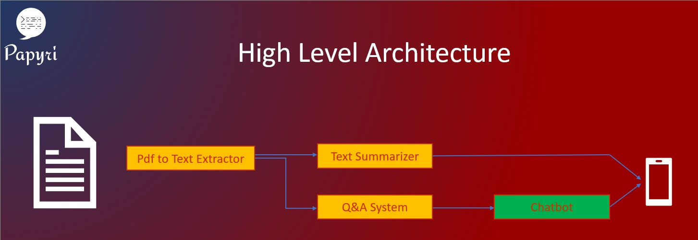
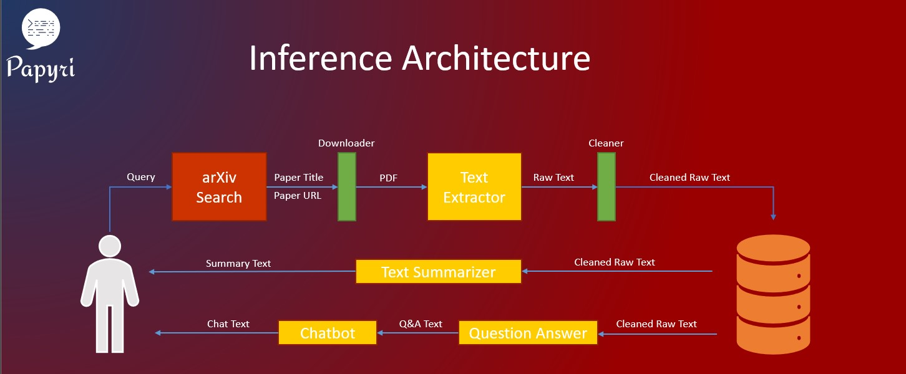
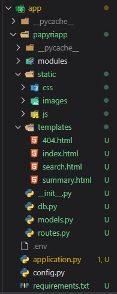
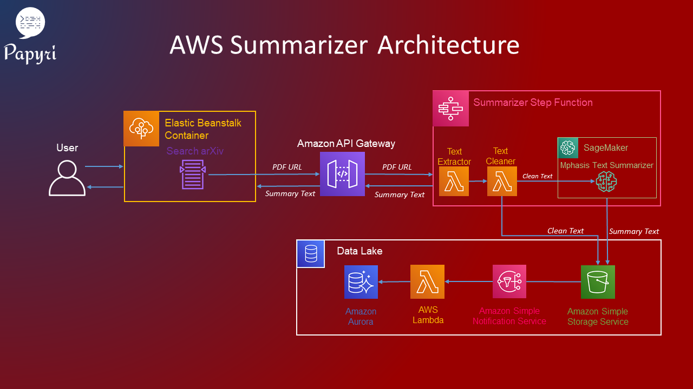
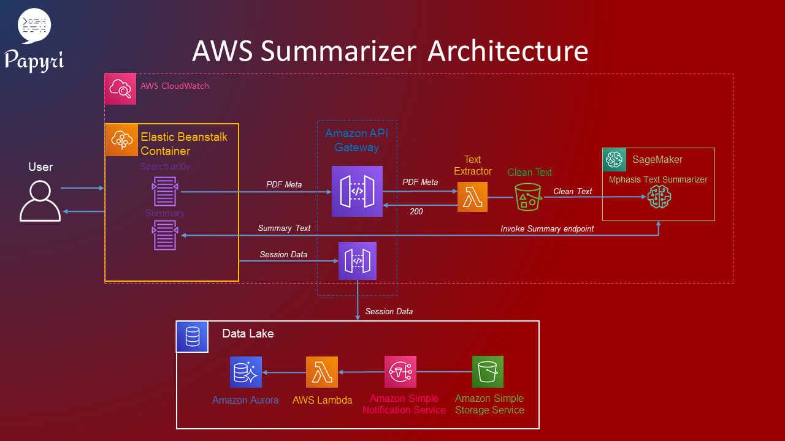

<h1>Building your first Machine Learning Web Application</h1>


<h2>Introduction</h2>


<h3>Prelude</h3>

As a Machine Learning Consultant, I had the privilege of working on different projects.
Clients often have different requests, they sometimes want just a package they can use as a swappable backend, but sometimes they want either a web application or a mobile application and in the beginning I tried to do everything by myself but I simply wasn't able to get things done on time because of the learning curve. This was because I wanted to learn something new with every project both on the Machine Learning side and the Software Engineering side so things became tough to manage so I hired two engineers to help me whenever I needed to build either a mobile or a web application. But I still wanted to learn how to do it by myself so I learned full stack web development and built my personal website (Website link) this is version 2.0 and my blogging website (website link).

There were a lot of resources on how to build web applications but not so much when you want to build a web application with a python backend, deployed in AWS which uses their services and uses Machine Learning. I knew I was asking a lot but this is a summary/tips/guide, pretty much everything that I thought a Machine Learning Engineer with a Python background would need to learn and build a Scalable Machine Learning Web Application end to end. So let's get started


<h3>User Requirements</h3>

Before building or writing any code, you need to clearly define the user story, and you should not move forward until you have one because this is where most mistakes happen in software development, misunderstanding what needs to be built.

Make sure you understand the features, what you are building and how a user will be using your application. Talking of user story, if you are not sure what that means or how to write one, I have taken few software engineering / development courses, if you are interested

- [Software Design and Architecture Specialization](https://www.coursera.org/specializations/software-design-architecture)
- [Software Development Lifecycle Specialization](https://www.coursera.org/specializations/software-development-lifecycle)

You don't really need to take the course to understand what I am going to talk about but if you are a learner and looking for something to learn, I would highly recommend those courses.

But to understand things better in this article and some of my design choices, I would recommend the smaller LinkedIn course: [Programming Foundations: Object-Oriented Design](https://www.linkedin.com/learning/programming-foundations-object-oriented-design-3/learn-object-oriented-design-principles) which you will have to pay if you don't have a pro account.

For the rest of the article I am going to link a bunch of LinkedIn courses, just because they are short in duration, you get a nice certificate to share on your LinkedIn but like I said, you might have to pay but if you don't want to, take a look at the course topics which I link and google, it might not be well put together but you still would be able to find what you are looking for and I will try to link as many free resources as possible.

Below is a few software principles I used to start the project, btw I use this in my work a lot so again, I highly recommend taking a course on software development or in the least on Object Oriented Programming. Even if you don't end up building something end to end, it will make you a better programmer.

- Write User Story (Add link to User story)
- Gather requirement
- Describe the application
- Identify the main objects
- Describe the interactions
- High level UML Component diagram (Link to the Component Diagram)
- Draw Use Case diagram (Link to Use Case Diagram)

All the architectures you see and you will see are first hand drawn and then I transfer it to digital using online tools. I will name the tools as we go into further design. The one above is just using powerpoint.


<h3>Architecture</h3>

Based on my user story, below is a very high level architecture on what components I will have. Note that this is the inference architecture, more on it later.



When you are developing a software there is a right way of doing things and a wrong way of doing it but there isn't one right way of doing it so below is a description of the architecture that I am using and what I think would make more sense for first timers.

So, as you know, machine learning has a train component and a inference component and you can separate the train and inference component. All you need to make inference are the weights of your model. So, what I am going to build things incrementally and think of the Machine Learning components as black boxes. I only need to know what its going to take in and what its going to give out for now. Since one of the requirements is to use AWS, there might be models that already does this and I don't even need to worry about training, and you can get predictions by using APIs.

If you see the architecture, it can clearly be broken down to three or four components, text extraction, summarization, question and answer, chatbot. Since I want to build things incrementally I first need to build the skeleton of my application, the front end and the Flask interface so after I build a component I can test its functionality and if everything's satisfying I then move to the next component. This works nicely if you follow an object oriented approach when writing your python components.


<h3>Learning</h3>

Before I start any client project, I spend a week or two depending on the size of the project and my background knowledge learning about the state of the art models and about any services I would need to use in the project. Similarly, for this project, I am new to AWS and Flask so the first week I am going to split into two and go through AWS Services and how to work with Flask.

Btw when you are learning a library, spend time depending on how much time you would spend writing code using it. So, if you wanna build a web app or a dynamic web site using JavaScript, you gotta spend some time. Take a look at (JavaScript in 30 days). But if you are probably going to write a function to download a pdf from url, spend an hour looking for how to do it, if there are optimized ways of doing it and if you find a library, what other functionalities does the library provide.

For Flask since its going to act as an interface and I already know front end development, I just needed to learn how it will work with AWS and some basic functionalities. So I looked for 1 hour videos and a bunch of blogs to get different views of Flask, to see what's possible I both looked at easy and advanced Flask stuff. But didn't really go in deep, though I am sure you can do it. But, I just don't want you to spend time learning way more than what you need cause specially me, I forget what I don't use.

I am also not going to just start learning everything in the AWS side, so I am going to just look into services that AWS offers that I think I can use and make a note of it. Then go step by step while building the components and dive deep into it.

So as I build these components my basic architecture will keep updating and evolving. Some may disagree with my approach but I prefer building evolving software architectures that grows with time and is flexible enough to adapt. Specially in the Machine Learning world things are growing so fast, there seems to be better ways of doing things every month. But I've found that when you look for flexibility, you sometimes tradeoff usability so I make sure I pick components that allow me to

1. Scalability
2. Loosely Coupled (Interchangeability)
3. Security

(Write the three main things to build a software)

at any point. And make sure you study the components you are using even if it takes some time to learn these stuff, please do, you will save a lot of time in the end rewriting things, spending a lot of money and ultimately build an app that can scale.

<h3>Cost</h3>

Speaking of money, since I am using some paid services, I need to make an initial rough cost of acquisition of a new customer, so below is a calculation for that.

(Cost Calculation)

Note that when you are working with clients this is something you definitely have to spend time on. I usually spend more time on calculating an accurate cost than the time I spend on this project cause I usually would have an idea what I am going to use to build my project, for example like the AWS service cost. So, the calculation you see here is updated ones based on AWS services.


<h3>Content</h3>

The following article is separated into three sections.
1. Section 1: Steps: Include pretty much what it sounds like, my end to end process in building this app
2. Section 2: Inference Engine: Has details on individual scripts I wrote and helpful tips on problems I ran into and how I solved
3. Section 3: Train Engine: Is same as Inference Engine except it has details about he training component.


Note that I try to build this like someone without any background but something that seems intuitive for me might not be for someone so if some design choices I make doesn't make sense, look ahead, I might have linked some resources and if it still doesn't make sense, please feel free to reach out. I love hearing from you, I might take some time to get back to you because of my tight schedule but I will definitely get back to you.


<h2>Steps</h2>


<h3>Inference Engine</h3>

Below is a first draft inference engine architecture. Note that the more I learn about Flask and AWS, I would keep updating it.



First of all I am going to start with the UI, I am already familiar with front end development so this should be easy. If you wanna learn web development, I highly recommend [The Complete 2020 Web Development Bootcamp](https://www.udemy.com/course/the-complete-web-development-bootcamp/), she is an awesome teacher and for a beginner you can learn tons.

Before building the UI I hand drew how the pages would look like based on the basic functionality. There are tons of free UI designer tools and I usually prefer those when I am building something for a client just so I can present things properly but I always start with a rough hand drawn sketch.  Btw, I am not a UI designer and this is a simple web app so 😉, below is how the UI I built looks like.


I used [Namecheap Free Logo Maker](https://www.namecheap.com/logo-maker/) to design the logo. Namecheap is where I bought all my domain names so if you are looking to buy one, I highly recommend them.

The UI you see here is just static, to make it functional like to enable searching arXiv and routing queries I need to write either JavaScript or python code and use Flask. But I didn't want to call the server first and then route the request to arXiv api and then read the request from the server and post the results to client. So, I chose to write JavaScript code that'll work on the client side.

The Complete 2020 Web Development Bootcamp teaches you upto say intermediate JavaScript and that would be enough to build some basic functionality needed for this app but to make for example an arXiv search work with reasonable latency and render the results, you need to know little bit of advanced JavaScript. I would recommend the [JavaScript in 30 Days]() I put together that will teach you everything from basic to advanced with exercises and examples or if you are familiar with basic JavaScript, you can take a look at the following LinkedIn course that can be useful to build something like what I did:

- [Building Web Applications with Ajax](https://www.linkedin.com/learning/building-web-applications-with-ajax/welcome)
- [JavaScript and AJAX: Integration Techniques](https://www.linkedin.com/learning/javascript-and-ajax-integration-techniques/welcome)

The JavaScript code isn't optimized yet, meaning, I am making asynchronous queries but loading all the results at the same time. I haven't seen a lag for queries upto 100 results but if it ends up being more I would need to optimize it but for a MVP I am not too worried, this is one of the things in my TO DO list. Btw if you are using VS Code, there is a nice extension called [Better Comments](https://marketplace.visualstudio.com/items?itemName=aaron-bond.better-comments) it'll highlight your code comments, check it out 😉.

Now that my app can search and present results, next I need to download and summarize the paper based on what the user selects. So before diving into the summarization, since the request to summarize will be made using Flask, I am going to learn about Flask and using Flask with AWS:

- [Flask for Beginners Tutorial - Learn Flask in 40 Minutes](https://www.youtube.com/watch?v=EnJKHVEzHFw)

I looked into other Flask tutorials and courses but they are too simple and even the ones that say they are advanced didn't really solve the problems I was having setting up my workflow so below are some tutorials that I used that helped me in this project. That being said the more basic ones are good for getting started but not really for big production-ready software applications.

- [Demystifying Flask’s Application Factory](https://hackersandslackers.com/flask-application-factory/)
- [Organizing Flask Apps with Blueprints](https://hackersandslackers.com/flask-blueprints/)
- [Configuring Your Flask App](https://hackersandslackers.com/configure-flask-applications/)
- [The Art of Routing in Flask](https://hackersandslackers.com/flask-routes/)

Based on what I learned, below is how I set up my app folder:



Setting up the folder structure might seem like a minor thing if you are a newbie but trust me, its not as easy as it seems and you wanna make sure you get it right because this is basically the blueprint of your app, the roadmap of where to start, how things will work and interact. That being said, there isn't one universal way of structuring the folders. It will depend on the type of [programming paradigm](https://cs.lmu.edu/~ray/notes/paradigms/) and [software design]() paradigm you will follow and also on some requirements of the framework you use.

This is basically my setup for the inference engine, will show my train engine folder structure later.

Since everything upto my search works using JavaScript, all I needed to setup were the routes in the Flask side so next, I will look into how I can deploy a Flask app in AWS.

- [Deploying a Flask application to AWS](https://medium.com/@rodkey/deploying-a-flask-application-on-aws-a72daba6bb80)

Next, I wanted to deploy this prototype and the above article mentions using [AWS Elastic Beanstalk](https://aws.amazon.com/elasticbeanstalk/). But there are other services like [AWS Lambda](https://aws.amazon.com/lambda/) and [AWS Fargate](https://aws.amazon.com/fargate/) that will allow you to deploy your apps. So to understand the differences, I went through:

- [AWS Lambda vs AWS Elastic Beanstalk](https://www.entranceconsulting.com/aws/aws-lambda-vs-elastic-beanstalk/)
- [Elastic Beanstalk vs ECS Fargate](https://www.reddit.com/r/aws/comments/7mjs6x/elastic_beanstalk_vs_ecs_fargate/)

Going through the above articles and the official documentations helped me understand my main application should reside in AWS Elastic Beanstalk for now because its easy to get started and I am going to use Lambda functions for invoking my functions like summarization and so on based on some trigger events like user selecting a paper to summarize.

I also have discussed to some extent in my notes why I picked Elastic Beanstalk (EBS) over Lambda and Fargate for initial deployment. To deploy my prototype with EBS I only used their developer guide:

- [AWS Elastic Beanstalk Developer Guide](https://docs.aws.amazon.com/elasticbeanstalk/latest/dg/Welcome.html)

And as all coders know, I ran into issues, very minor head banging issues we usually run into.
1. AWS required me to create an application object since I was using Flask, not an app object in my application.py, so basically

```python
application = app = Flask(__name__)
```

2. My css and js didn't load. So I found out that EB doesn't read static file location by default so I had to specify that
in a .ebextensions folder with the following python config:

```
option_settings:
    aws:elasticbeanstalk:container:python:staticfiles:
        /static: papyriapp/static/
```

So far my app is able to search arXiv papers, next, it should download the file the user selects and extract the text from the pdf. When I was looking into ways of extracting text from pdf I came across few libraries and I initially wrote the text extraction in python using pdfminer but later I came across [Amazon Textract](https://aws.amazon.com/textract/) and explored if I could integrate that with my work.

This was also when I understood how steep of a learning curve you have to get up to speed with AWS. Building PoCs and models and web apps is easy, you have tons of resources and you bundle everything together and deploy and I've done it tons of time with GCP. But building an app that scales is much much difficult, let me rephrase, building a Machine Learning App that is scalable and cost efficient is very difficult. Yes, AWS has services that auto-scales and load balances and stuff, but that is not the only thing you need to worry about, below are some questions I was wrestling with.

- Cost, I can easily package all the services and put it in AWS Elastic Beanstalk and call it a day, but it will burn through my wallet.

- So, containerizing my solutions is the best, so, let's have all the static content and everything upto searching or even text extraction in AWS EBS and use a low power instance. Then create an API Gateway and call other services like textract or SageMaker for ML through AWS Lambda. Cool, this is a good idea.

- Now, building the API gateway, all the examples I found on how to do that was like hello world examples and they relied on the online AWS Code editor to get things done, which would be fine if you aren't worried about scaling, meaning, at some point, you will have to work with others and imagine the hassle if the only way to make modifications was through an online code editor, good luck.

- So, I need a code pipeline, basically a way to deploy from command line with version control and continuous integration/development. AWS EBS has the elastic beanstalk package that let's you deploy from command line and you also have [AWS CodePipeline](https://aws.amazon.com/codepipeline/) to help with the CI/CD but I didn't know how this all will work together, I basically need to setup a streamed pipeline so when I make changes to the app, I just have to run a command or a shell script and everything will go through version control and testing and then deploy as Blue-green deployment.

- Now the Lambda functions, jeez this was driving me nuts, my technique of jumping in by just going through the documentation of Lambda Functions didn't work, don't get me wrong, the documentation was good, it was just at this point, I was working with a lot of things I didn't understand, AWS EBS, AWS Lambda, Flask and AWS API gateway and on top of that how am I going to integrate all of this with AWS SageMaker. This was when I realized how big of a beast AWS was, there were tons of services that pretty much did similar things except with minor but very important differences. This was when I even started questioning my decision to use EBS cause whenever I searched for how EBS would work with AWS Lambda I just found either or solutions. I even went through [AWS Samples](https://github.com/aws-samples) which had tons of examples and I just couldn't find what I was looking for. I didn't think it couldn't be done, I just knew I was taking too big of a chunk than I can chew.

- This was when I took a step back, I know what I am building but I just don't know the tools I am going to use and since I didn't want to reuse the same tool and only pick the tools I need, the only way was for me to stop coding, the hard part and learn about all the tools I had.

- The other problem I had was, I was thinking locally, I know how to set up a CI/CD pipeline for an app for single users but when you want to serve multiple users, you need to change how you think. It doesn't mean you have to start from scratch, you just have to change how you think about the whole process.

- I need to start with general AWS Services to see what I can use from the AWS stack, then AWS EBS, Lambda functions, API Gateway, SageMaker and while I was going through all this documentation I found [Mphasis DeepInsights Text Summarizer](https://aws.amazon.com/marketplace/pp/prodview-uzkcdmjuagetk?ref_=srh_res_product_title) to build the summaries and [Amazon Lex](https://aws.amazon.com/lex/) for the chatbot so I am thinking of going through these as well. I know I am in a tight deadline but I also know I won't be able to build what I want with everything I want if I don't go through everything, even if somethings I wouldn't use. I just need to build my complete inference architecture before progressing.

Remember, the first time you are learning something, its natural to stumble, fall and even fail miserably, the important thing is to stand up, learn from your mistake and keep going.

So, this is my plan for the next week, I am going to go through:

- [Amazon Web Services: Exploring Business Solutions](https://www.linkedin.com/learning/amazon-web-services-exploring-business-solutions)
- [AWS Essential Training for Architects](https://www.linkedin.com/learning/aws-essential-training-for-architects)
- [Flask Essential Training](https://www.linkedin.com/learning/flask-essential-training/web-development-with-flask)
- [Amazon Web Services Machine Learning Essential Training]()

I understand not everyone will have access to LinkedIn learning so for those, YouTube is your best friend, take a look at [AWS Events](https://www.youtube.com/channel/UCdoadna9HFHsxXWhafhNvKw), [Amazon Web Services](https://www.youtube.com/channel/UCd6MoB9NC6uYN2grvUNT-Zg) and [AWS Online Tech Talks](https://www.youtube.com/user/AWSwebinars) they have amazing talks, might not be as hands-on as the LinkedIn course, but for those you can fill with blogs, the main thing is understanding the concepts. Some YouTube talks you can go through:

- [Scaling on AWS for the First 10 Million Users](https://www.youtube.com/watch?v=Ma3xWDXTxRg)
- [Deploying Cost-Effective Deep Learning Inference](https://www.youtube.com/watch?v=WiCougIDRsw)
- [Build, Train and Deploy Machine Learning Models on AWS with Amazon SageMaker](https://www.youtube.com/watch?v=R0vC31OXt-g)

I also went through the following short videos to look into what kind of architectures some companies are using:

- [Using AWS Lambda for its Decoupled Content Deployment Architecture](https://www.youtube.com/watch?v=oDLUTgEn2gc)
- [Serverless Architecture pattern for Melco Club mobile app](https://www.youtube.com/watch?v=amh7nzl32v4)
- [Building a Serverless Website Archival Workflow on AWS](https://www.youtube.com/watch?v=kGwX0H0eukU)
- [Expedia's Automated CI/CD Platform with Github, Jenkins and Amazon ECS](https://www.youtube.com/watch?v=ry5GmEFa7P8)
- [Building Optimized ML Models with Amazon SageMaker](https://www.youtube.com/watch?v=LPZlrX2cNjo)
- [Machine Learning and Automated Model Retraining with SageMaker](https://www.youtube.com/watch?v=1kbWvlHBYLk)
- [How to build a scalable chatbot and deploy to Europe’s largest airline](https://www.youtube.com/watch?v=dAQhNjwkOX8)

Finally, some reading materials I went through:

- [AI/ML Based Intelligent Email Responder](https://d1.awsstatic.com/architecture-diagrams/ArchitectureDiagrams/ai-ml-based-intelligent-email-responder-ra.pdf)
- [AWS Serverless Multi-Tier Architectures](https://d1.awsstatic.com/whitepapers/AWS_Serverless_Multi-Tier_Architectures.pdf)

Well, that was a lot, below is my initial summarizer architecture:



While working on this I realized few things so I changed my architecture to:



Below are the reasons for changing the architecture.

- If you see its not a lot of changes, so let's talk a bit about my initial architecture and then the reasons for changing it.

- In my initial architecture I decoupled the components into three microservices, basically:

    - _Presentation_: Where my webpage and search function resides and I am using AWS Elastic BeanStalk for that. And I make API calls through the API Gateway to my other components.

    - _Summarizer_: This is the summarization component inside the step function. I went with the step function because I need to pass the output from the extractor Lambda to cleaner and then to the summarizer. With Step functions if I choose to go with a different custom summarizer, that is very easy as well. It also helps with parallelly storing the raw text and the summary text in an S3 bucket. But with the passing data, I ran into Step Function limitations. Step functions have a 32,768 characters limit for input output data between the tasks and that's a hard limit so I can't change that so the only way was to move the cleaner into the extractor. That worked well for me cause my extractor was compute heavy and it didn't have a reasonable latency with the standard instance that comes with Lambda and the cleaner wasn't utilizing the standard instance fully so moving both of it together for a larger instance made sense and but I still have a 2.2s latency with the extractor, which I am planning to reduce next by either writing the extractor in C or use the AWS Textractor.

        Now I have the extractor lambda function which send cleaned data to S3 and then invokes the SageMaker endpoint. The text extractor I used only reads either data passed from S3 or local storage and due to the Step Function limit I couldn't pass the file and since the text extractor can stream data, it didn't make sense for me to keep it behind a step function, I can directly invoke the step function via Flask and get the predictions and store it in the browser local storage and once the session ends, I can send all the meta data to the S3 bucket via the API Gateway. This will save some extra lambda and API calls so I went with that architecture.

    - _Data_: Stores all the data from text to performance measures and everything. For now this just has the text storage, it will be modified to store performance metric data later.

- Some helpful links that I used to setup the architecture:

    - I used the following link to setup the API Gateway to talk with the Step Function:
    [Creating a Step Functions API Using API Gateway](https://docs.aws.amazon.com/step-functions/latest/dg/tutorial-api-gateway.html)

    - In general the [AWS Step Functions Documentation](https://docs.aws.amazon.com/step-functions/latest/dg/welcome.html) is pretty good and you should find answers to most of your problems.

- So, that's pretty much it, oh and I also enabled CloudWatch on all my services.

Note that I still haven't incorporated the Chatbot and CI/CD pipeline and the training pipeline here. I just want to build the summarizer architecture first and then look into easy ways of integrating the rest.

I have some other ideas about storage, basically to use a graph storage instead of the storage architecture I have above cause I want the database to act like a knowledge discovery database for my chatbot so that it improves over time and uses material from other research papers to answer questions.

Btw couple of gotchas when you try to deploy using EBS, make sure you have a `.ebextensions` folder with a `python.config` and `wsgi.config`, the python config is pretty straightforward, you just need to specify where the static files are:

```
option_settings:
    aws:elasticbeanstalk:container:python:staticfiles:
        /static/: papyriapp/static/
```

The wsgi config is something I am not 100% familiar with yet and my app ran into timeout issues because some of the packages I am using have C extensions and I need to specify some stuff with the wsgi config, like I said, I am not 100% sure what these means yet so that's why I am being vague but what worked for me is:

```
files:
  "/etc/httpd/conf.d/wsgi_custom.conf":
    mode: "000644"
    owner: root
    group: root
    content: |
      WSGIApplicationGroup %{GLOBAL}
```

I found the code in one of the AWS ElasticBeanstalk SDK examples in GitHub and if this doesn't work for you, take a look at the GitHub example configs. I will write more about this later after I go through this.

The Elastic Beanstalk is load balanced with a minimum of 2 instances and a max of 4 instances, with t2.small (1vCPUs, 2GiB) and t2.medium (2vCPUs, 4GiB) instances. The instances will increase by 1 if the CPU utilization increases by more than 70% and decreases by 1 if it goes below 20%. In the 2 instances, 1 is a spot instance and another one is a on demand instance with high availability.


To keep track:

- AWS Architecture with Chatbot

I should look into Simple Workflow service to parallelize creating a summary and then starting the QnA model, I can render the summary as soon as its done and then keep on processing the QnA in the background and then render that to make the user feel like he hasn't been waiting a long time. Or, I can also add like a start chat button and only when that's clicked, I invoke the chatbot to reduce cost.

- AWS Architecture with CI/CD

[Practicing Continuous Integration and Continuous Delivery on AWS](https://d1.awsstatic.com/whitepapers/DevOps/practicing-continuous-integration-continuous-delivery-on-AWS.pdf)

See how you can use Cloudwatch to get notifications of increased usage. By utilizing the API, Cloudwatch can also be used to monitor custom metrics generated by custom applications running in the cloud. Think about what applications or metrics do I need to track.

Look into CloudFormation and CloudFormer templates to see if you can use those in your work.

I can use SNS to monitor my application and get notified if something goes wrong or there is a spike in usage.

- AWS Training architecture

[Deep Learning on AWS](https://d1.awsstatic.com/whitepapers/Deep_Learning_on_AWS.pdf)


- Papyri Architecture

AWS has this [AWS Architecture Center](https://aws.amazon.com/architecture) where you can take a look at a bunch of architectures and they also have a [AWS Well-Architected Tool](https://aws.amazon.com/well-architected-tool/) to evaluate architectures.


Below is a database where I am going to store some meta data that could be later used for making my model better:
1. Paper title
2. Link extracted paper (S3 bucket link)
3. Link to cleaned paper (S3 bucket link)
4. Link to paper summary (S3 bucket link)
5. Link to question and answer (S3 bucket link)
6. Link to chatbots chat (S3 bucket)
7. Chatbot rating
8. Chatbot comments
8. Summary rating

I want to either store all of it in a bucket and update a csv with the links or store the csv in a sql database and store the original content in a bucket. I need to link into this.


Finally, I can't stress this enough, please write unit and integration test at the least. If you see my folder structure, when I created the files, I also made sure to create test files and before I start writing another module. What I will do now is, write test for my scrapper and converter and cleaner functions. After testing the functions individually which is appropriately called Functional Testing, I will put these in the unit_test file and see if they function completely as a file, this can only be done if you follow an object oriented approach and set up your files and modules correctly.

Next I would write the component test, for example the first component we built was the text_extraction module so I will test if that works as it should and put it under the text_extraction class. I will follow a similar approach to all the python related stuff. Note that people may have different names for the types of testing I mentioned, all you need to understand is the basic concepts of it and why you need to do it. And if this is your first time to testing, please see the links below:

(Software Testing Types Links)

- [Types Of Software Testing: Different Testing Types With Details](https://www.softwaretestinghelp.com/types-of-software-testing/)

So, if you had noticed my testing file, there was a integration testing file, which is what I am going to use to test if two components or more work together as they should. For example, like does my front end and back end communicate properly.


***

<h3>Training Engine</h3>

Now, to actually make the inference, I need the machine learning components. So below is my initial training architecture

(Training architecture image)


Make sure you write logs to collect parameters, results, application identifier and timestamps in the log file. You need to keep track of what papers were requested to be summarized, the basic routes it went through, whether the output was stored and timestamps on how long the process took and various endpoints it went through so later I can optimize these endpoints and limit the routing.


Note that in the training machine learning architecture there are a lot of services I can use for example to tune my architecture, monitor performance and so on and I will add AWS and other services stage by stage when we go deeper into the training and deploying. But if this is your first time to deploying Machine Learning models and scaling, I also found the following course in LinkedIn:

- [Deploying Scalable Machine Learning for Data Science](https://www.linkedin.com/learning/deploying-scalable-machine-learning-for-data-science/scaling-ml-models)

- [DevOps for Data Scientists](https://www.linkedin.com/learning/devops-for-data-scientists/welcome)

So below is my deployment architecture:

(Training Deployment architecture image)


System Testing, is where I test my overall system based on user requirements.


My APIs for the Machine Learning models and how they are going to communicate with my Inference Engine:

(API Architecture)

I am going to use [Swagger](https://swagger.io/) to generate documentation for my API.


I also need to write memory profiler for my machine learning models and store that data when I run training in the cloud, see if there are easy tools for that in the cloud or whether I have to write one.


***

<h3>Deploy</h3>

When deploying, focus on monitoring tools. You need to be able to detect issues before your customers do so try to incorporate monitoring tools. The ones I am going to focus on are,

1. Application performance, which I am achieving through logs
2. Container performance, I am going to use docker stats and store the data in a database
3. Kubernetes Cluster through their API


Now we are ready to deploy. We can start by containerizing the inference engine:

(Inference Engine to be containerized image)

Below are some links on how to write a Dockerfile.


Note that since I have different requirements for my inference and train engine, I am thinking of creating two separate docker images.

(Train Engine to be containerized image)


Note that I also need to set up a system so I can get the ratings of the summaries and chats and store it and use that to tune my model later. So, I need a database to store these and below is an update architecture of the training and inference architecture with the database.

(Updated Machine Learning Training and inference Architecture image)


Now, storing the summaries isn't enough, usually machine learning model performance decays with time if you don't retrain it with new labels, its just the time of decay will be different so what I am going to do is. Create some tasks where I store x amount of summaries and user ratings, then get the summaries and create an Amazon Mechanical Turk Job where you label the summaries and once it labels, I will create a new job to retrain my model with the new data. I don't have to train from scratch or using all the data though this is debatable as to which gives better performance. You can experiment and use whichever works best for you, it will also depend on the training cost so, I will just use transfer learning and retrain with the new data so as to customize my model. Below is my Full Training Inference architecture.

(Updated Joined Training and inference Architecture image)


I also want to use some automated tools to automate version controlling my data and models, automating testing of the models and updates.

I also need to use certain monitoring tools proposed by dev ops principles like setting up pings for monitoring the health of my containers and clusters and check the usage.


After Deploying, get customer feedback. How much are you willing to pay to use this per month, what additional features would you like to see.

I have to write a script to collect quality control data so I can use that to test how a newer version of the model performs, basically AB testing.


Set up your docker container to monitor the application. Make sure it collects CPU utilization, Memory utilization, Disk performance information, which includes both the rate of IO block information and disk utilization, also monitor the network and understand the level of IO traffic on the network. The docker stats provides a live stream of data but it is not persistent so I have to set up a database to store this data.


***


<h2>Inference Engine</h2>


<h3>Flask App</h3>

I was familiar with building the Python components but I wanted to start with front end first because that'll solidify the user requirements and how the app will work. This isn't always possible when working with clients and if you are just building a small component or if you have separate developers then you need to follow Agile principles. Since this was just me, I don't have to worry a lot about the constraints that comes with top down approach and even though it was just me, I still followed Agile principles to make sure I was on time with things and following requirements.


<h3>Text Extractor</h3>

- Make sure you have a logger and save the log files, it'll be helpful in future (Write about why logging is helpful).

A logger can help you monitor the performance of your application.


__arXiv Scrapper__

Found a nice library called [arxiv](https://github.com/lukasschwab/arxiv.py) to scrape arxiv papers. I am not installing it, borrowed the script and modified  it to my need. Didn't need some of the extra bells and whistles and modified it to fit my need.

- I can use [this](https://github.com/Mahdisadjadi/arxivscraper) to add a time component where you can scrape from certain date to date

__pdf extractor__

Tried PyPDF2 and it was crap. And don't install pdfminer, nor pdfminer.six, the correct version is [pdfminer3](https://github.com/gwk/pdfminer3) but this sometimes might get installed in the wrong folder so, I just took the pdf2txt.py script that comes with it. You can find it in Scripts under the Anaconda env folder you are using. I will also highly recommend using anaconda to manage your packages cause when I tried to install pdfminer instead of pdfminer3 by accident, pdfminer tried to remove tensorflow 2 so before installing, make sure you look at which packages will be installed, upgraded or removed before saying yes to install a new package and you can only do this if you are installing using conda and not pip3. Note that I also tried slate3k but the extraction is not good at all even though they say it is from pdfminer.

- The extract_text from pdfminer3 wasn't there so I thought I'll just copy the files and modify it. The reason it the I/O cost of reading the files and saving it to the s3 bucket. And since the text size is pretty small, I can just keep things in memory and process it.

- From stack overflow:

Best thing for text extraction from PDFs is [TET](https://www.pdflib.com/), the text extraction toolkit. TET is part of the PDFlib.com family of products. But PDFlib TET can be evaluated without a license, but will only process PDF documents with up to 10 pages and 1 MB size unless a valid license key is applied. For some other solutions, which are pretty good, take a look at [this](https://stackoverflow.com/questions/3650957/how-to-extract-text-from-a-pdf)

_Textractor_


__Notes__

I want to start with an easy solution, that is why I am going with a pdf extractor route, in the later versions, I am thinking of removing this and doing some layout analysis and extracting text from that.

I also found later when I started going through AWS services that they have a text extractor that does OCR so I am thinking of using that.


<h3>AWS Components</h3>


<h3>Machine Learning APIs</h3>


<h3>Containerization</h3>


<h3>Scaling</h3>


<h2>Train Engine</h2>


<h3>Text Summarizer</h3>


<h3>Question Answering</h3>

I can just collect research papers and train BERT, if you read how BERT is trained, it uses Masked Language Modeling and Next Sentence Prediction. I can try to randomly mask words on a research paper by randomly masking 15% of the words, I should also look into details of how this masking was done.

For the Next Sentence Prediction, all I have to do is split the text by sentences and for 50% of the pairs the second sentence will be the true next sentence and for 50% the next sentence will not be and then label it 1 or 0 and train a classification model.


<h3>Chatbot</h3>


<h3>Training</h3>


<h3>APIs</h3>


<h3>Tuning</h3>


<h3>Monitoring</h3>


<h2>Future Work</h2>

- I can add a button so the user can directly upload the pdf he wants to summarize
- When the user searches and clicks on a paper to summarize, I can show that a previous summary exists and render that without calling a new summarizer.
