<h1>Notes</h1>

<h2>Intro to OCR</h2>

[Link](https://towardsdatascience.com/a-gentle-introduction-to-ocr-ee1469a201aa)

The text recognition is a two step task:
1. You would need to detect the text

After detecting the line/word level we can choose once again from a large set of solutions, which generally come from three main approaches:

<h3>Classic computer vision techniques</h3>

1. Apply filters to make the characters stand out from the background.
2. Apply contour detection to recognize the characters one by one.
3. Apply image classification to identify the characters.

The challenge is with two, if that is done well then part three can be done with either pattern matching or machine learning.

<h3>Specialized deep learning</h3>

__[EAST](https://arxiv.org/pdf/1704.03155.pdf)__ ( Efficient accurate scene text detector) is a simple yet powerful approach for text detection. Using a specialized network.
Unlike the other methods we’ll discuss, is limited only to text detection (not actual recognition) however it’s robustness make it worth mentioning.
Another advantage is that it was also added to open-CV library (from version 4) so you can easily use it (see tutorial [here](https://www.pyimagesearch.com/2018/08/20/opencv-text-detection-east-text-detector/)).

__CRNN__ (Convolutional-recurrent neural network), suggest a hybrid (or tribrid?) end to end architecture, that is intended to capture words, in a three step approach.
The idea goes as follows: the first level is a standard fully convolutional network. The last layer of the net is defined as feature layer, and divided into “feature columns”. See in the image below how every such feature column is intended to represent a certain section in the text.

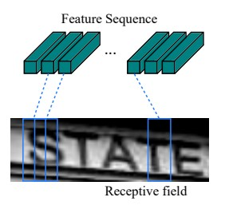

Afterwards, the feature columns are fed into a deep-bidirectional LSTM which outputs a sequence, and is intended for finding relations between the characters.

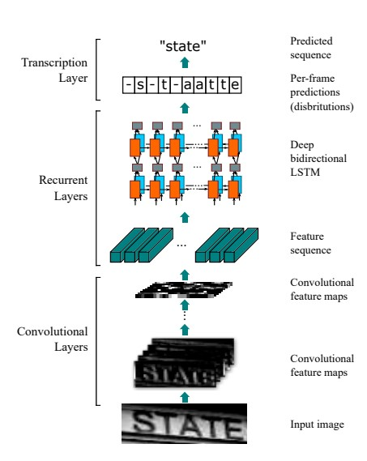

Finally, the third part is a transcription layer. Its goal is to take the messy character sequence, in which some characters are redundant and others are blank, and use probabilistic method to unify and make sense out of it.

This method is called CTC loss, and can be read about [here](https://gab41.lab41.org/speech-recognition-you-down-with-ctc-8d3b558943f0). This layer can be used with/without predefined lexicon, which may facilitate predictions of words.

This paper reaches high (>95%) rates of accuracy with fixed text lexicon, and varying rates of success without it.

<h3>Standard deep learning approach (Detection)</h3>

After detecting the “words” we can apply standard deep learning detection approaches, such as SSD, YOLO and Mask RCNN.

<h2>Bank check OCR with OpenCV and Python</h2>

[Link](https://www.pyimagesearch.com/2017/07/24/bank-check-ocr-with-opencv-and-python-part-i/)

Bank checks used special fonts where a particular symbol consists of multiple parts — this implies that we need to devise a method that can automatically compute the bounding boxes for these symbols and extract them.

However, while our template matching method worked correctly on this particular example image, real-world inputs are likely to be much more noisy, making it harder for us to extract the digits and symbols using simple contour techniques.

In these situations, it would be best to localize each of the digits and characters followed by applying machine learning to obtain higher digit classification accuracy. Methods such as Histogram of Oriented Gradients + Linear SVM and deep learning will obtain better digit and symbol recognition accuracy on real-world images that contain more noise.

<h2>Creating a Modern OCR Pipeline Using Computer Vision and Deep Learning</h2>

[Link](https://blogs.dropbox.com/tech/2017/04/creating-a-modern-ocr-pipeline-using-computer-vision-and-deep-learning/)

For our Word Detector we decided to not use a deep net-based approach. The primary candidates for such approaches were object detection systems, like RCNN, that try to detect the locations (bounding boxes) of objects like dogs, cats, or plants from images. Most images only have perhaps one to five instances of a given object.

However, most documents don’t just have a handful of words — they have hundreds or even thousands of them, i.e., a few orders of magnitude more objects than most neural network-based object detection systems were capable of finding at the time. We were thus not sure that such algorithms would scale up to the level our OCR system needed.

We ended up using a classic computer vision approach named Maximally Stable Extremal Regions ([MSERs](https://en.wikipedia.org/wiki/Maximally_stable_extremal_regions)), using OpenCV’s implementation. The MSER algorithm finds connected regions at different thresholds, or levels, of the image. Essentially, they detect blobs in images, and are thus particularly good for text.

Our Word Detector first detects MSER features in an image, then strings these together into word and line detections. One tricky aspect is that our word deep net accepts fixed size word image inputs. This requires the word detector to thus sometimes include more than one word in a single detection box, or chop a single word in half if it is too long to fit the deep net’s input size. Information on this chopping then has to be propagated through the entire pipeline, so that we can re-assemble it after the deep net has run. Another bit of trickiness is dealing with images with white text on dark backgrounds, as opposed to dark text on white backgrounds, forcing our MSER detector to be able to handle both scenarios.

<h2>An Introduction to Text Summarization using the TextRank Algorithm</h2>

[Link](https://www.analyticsvidhya.com/blog/2018/11/introduction-text-summarization-textrank-python/)

Text summarization can broadly be divided into two categories — _Extractive Summarization_ and _Abstractive Summarization_.

- Extractive Summarization: These methods rely on extracting several parts, such as phrases and sentences, from a piece of text and stack them together to create a summary. Therefore, identifying the right sentences for summarization is of utmost importance in an extractive method.

- Abstractive Summarization: These methods use advanced NLP techniques to generate an entirely new summary. Some parts of this summary may not even appear in the original text.

TextRank is an extractive and unsupervised text summarization technique. Let’s take a look at the flow of the TextRank algorithm that we will be following:

<h2>Comprehensive Guide to Text Summarization using Deep Learning in Python</h2>

[Link](https://www.analyticsvidhya.com/blog/2019/06/comprehensive-guide-text-summarization-using-deep-learning-python/)

A potential issue with this encoder-decoder approach is that a neural network needs to be able to compress all the necessary information of a source sentence into a fixed-length vector. This may make it difficult for the neural network to cope with long sentences. The performance of a basic encoder-decoder deteriorates rapidly as the length of an input sentence increases.

So how do we overcome this problem of long sequences? This is where the concept of attention mechanism comes into the picture. It aims to predict a word by looking at a few specific parts of the sequence only, rather than the entire sequence.

<h2>Text Summarization for busy people</h2>

[Link](https://wiki.ubc.ca/Course:CPSC522/Text_Summarization_for_busy_people!)

<h2>Text Summarization with Python</h2>

[Link](https://medium.com/@umerfarooq_26378/text-summarization-in-python-76c0a41f0dc4)

gensim.summarization offers TextRank summarization.

PyTeaser takes any news article and extracts a brief summary from it.

Summaries are created by ranking sentences in a news article according to how relevant they are to the entire text. The top 5 sentences are used to form a “summary”. Each sentence is ranked by using four criteria:
- Relevance to the title
- Relevance to keywords in the article
- The position of the sentence
- Length of the sentence

pytextrank is the Python implementation of TextRank.

<h2>Demystifying BERT: A Comprehensive Guide to the Groundbreaking NLP Framework</h2>

[Link](https://www.analyticsvidhya.com/blog/2019/09/demystifying-bert-groundbreaking-nlp-framework/)

BERT is a deep learning model that has given state-of-the-art results on a wide variety of natural language processing tasks. It stands for _Bidirectional Encoder Representations for Transformers_. It has been pre-trained on Wikipedia and BooksCorpus and requires (only) task-specific fine-tuning.

BERT has inspired many recent NLP architectures, training approaches and language models, such as Google’s TransformerXL, OpenAI’s GPT-2, XLNet, ERNIE2.0, RoBERTa, etc.

ELMo was the NLP community’s response to the problem of Polysemy – same words having different meanings based on their context. From training shallow feed-forward networks (Word2vec), we graduated to training word embeddings using layers of complex Bi-directional LSTM architectures. This meant that the same word can have multiple ELMO embeddings based on the context it is in.

ULMFiT took this a step further. This framework could train language models that could be fine-tuned to provide excellent results even with fewer data (less than 100 examples) on a variety of document classification tasks. It is safe to say that ULMFiT cracked the code to transfer learning in NLP.

OpenAI’s GPT extended the methods of pre-training and fine-tuning that were introduced by ULMFiT and ELMo. GPT essentially replaced the LSTM-based architecture for Language Modeling with a Transformer-based architecture.

The GPT model could be fine-tuned to multiple NLP tasks beyond document classification, such as common sense reasoning, semantic similarity, and reading comprehension.

GPT also emphasized the importance of the Transformer framework, which has a simpler architecture and can train faster than an LSTM-based model. It is also able to learn complex patterns in the data by using the Attention mechanism.

__Architecture of BERT__

BERT is a multi-layer bidirectional Transformer encoder. There are two models introduced in the paper.

- BERT base – 12 layers (transformer blocks), 12 attention heads, and 110 million parameters.
- BERT Large – 24 layers, 16 attention heads and, 340 million parameters.

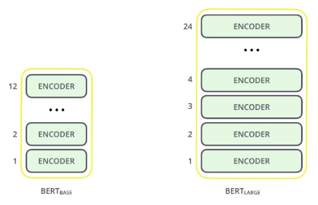

__Preprocessing Text for BERT__

The input representation used by BERT is able to represent a single text sentence as well as a pair of sentences (eg., Question, Answering) in a single sequence of tokens.

- The first token of every input sequence is the special classification token – [CLS]. This token is used in classification tasks as an aggregate of the entire sequence representation. It is ignored in non-classification tasks.

- For single text sentence tasks, this [CLS] token is followed by the WordPiece tokens and the separator token – [SEP].

- For sentence pair tasks, the WordPiece tokens of the two sentences are separated by another [SEP] token. This input sequence also ends with the [SEP] token.

- A sentence embedding indicating Sentence A or Sentence B is added to each token. Sentence embeddings are similar to token/word embeddings with a vocabulary of 2.

- A positional embedding is also added to each token to indicate its position in the sequence.

BERT developers have set a a specific set of rules to represent languages before feeding into the model.

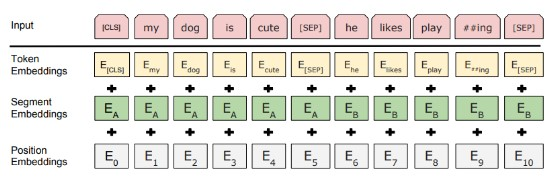

Every input embedding is a combination of 3 embeddings:

- _Position Embeddings_: BERT learns and uses positional embeddings to express the position of words in a sentence. These are added to overcome the limitation of Transformer which, unlike an RNN, is not able to capture “sequence” or “order” information

- _Segment Embeddings_: BERT can also take sentence pairs as inputs for tasks (Question-Answering). That’s why it learns a unique embedding for the first and the second sentences to help the model distinguish between them. In the above example, all the tokens marked as EA belong to sentence A (and similarly for EB)

- _Token Embeddings_: These are the embeddings learned for the specific token from the WordPiece token vocabulary

For a given token, its input representation is constructed by summing the corresponding token, segment, and position embeddings.

These combinations of preprocessing steps make BERT so versatile. This implies that without making any major change in the model’s architecture, we can easily train it on multiple kinds of NLP tasks.

__Pre Training__

The model was trained in two tasks simultaneously:

1. Masked Language Model-

    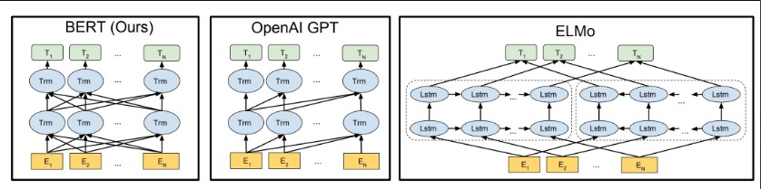

    The arrows indicate the information flow from one layer to the next. The green boxes at the top indicate the final contextualized representation of each input word.

    It’s evident from the above image: BERT is bi-directional, GPT is unidirectional (information flows only from left-to-right), and ELMO is shallowly bidirectional.

    This is where the _Masked Language Model_ comes into the picture.

    The authors of BERT also include some caveats to further improve this technique:
    - To prevent the model from focusing too much on a particular position or tokens that are masked, the researchers randomly masked 15% of the words

    - The masked words were not always replaced by the masked tokens [MASK] because the [MASK] token would never appear during fine-tuning

    - So, the researchers used the below technique:
        - 80% of the time the words were replaced with the masked token [MASK]
        - 10% of the time the words were replaced with random words
        - 10% of the time the words were left unchanged

2. Next Sentence Prediction-

    Masked Language Models (MLMs) learn to understand the relationship between words. Additionally, BERT is also trained on the task of Next Sentence Prediction for tasks that require an understanding of the relationship between sentences. A good example of such a task would be question answering systems.

    Consider that we have a text dataset of 100,000 sentences. So, there will be 50,000 training examples or pairs of sentences as the training data.

    - For 50% of the pairs, the second sentence would actually be the next sentence to the first sentence
    - For the remaining 50% of the pairs, the second sentence would be a random sentence from the corpus
    - The labels for the first case would be ‘IsNext’ and ‘NotNext’ for the second case

And this is how BERT is able to become a true task-agnostic model. It combines both the Masked Language Model (MLM) and the Next Sentence Prediction (NSP) pre-training tasks.

<h2>How do Transformers Work in NLP? A Guide to the Latest State-of-the-Art Models</h2>

[Link](https://www.analyticsvidhya.com/blog/2019/06/understanding-transformers-nlp-state-of-the-art-models/?utm_source=blog&utm_medium=demystifying-bert-groundbreaking-nlp-framework)

__RNN based Sequence-to-Sequence Model__

- Both Encoder and Decoder are RNNs.

- At every time step in the Encoder, the RNN takes a word vector (xi) from the input sequence and a hidden state (Hi) from the previous time step

- The hidden state is updated at each time step

- The hidden state from the last unit is known as the context vector. This contains information about the input sequence

- This context vector is then passed to the decoder and it is then used to generate the target sequence (English phrase)

- If we use the Attention mechanism, then the weighted sum of the hidden states are passed as the context vector to the decoder

Despite being so good at what it does, there are certain limitations of seq-2-seq models with attention:
- Dealing with long-range dependencies is still challenging
- The sequential nature of the model architecture prevents parallelization. These challenges are addressed by Google Brain’s Transformer concept

The Transformer is the first transduction model relying entirely on self-attention to compute representations of its input and output without using sequence-aligned RNNs or convolution.

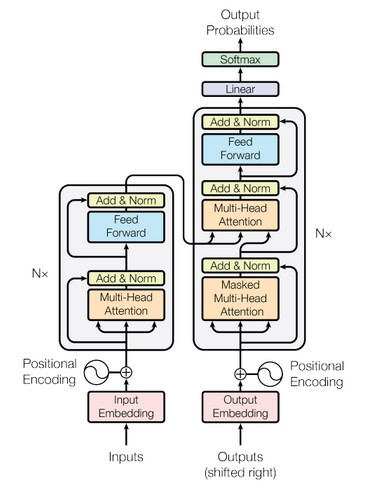

In the image above, the left represents the encoder and the right represents the decoder. The Encoder block has 1 layer of a Multi-Head Attention followed by another layer of Feed Forward Neural Network. The decoder, on the other hand, has an extra Masked Multi-Head Attention.

The encoder and decoder blocks are actually multiple identical encoders and decoders stacked on top of each other. Both the encoder stack and the decoder stack have the same number of units.

The number of encoder and decoder units is a hyperparameter. In the paper, 6 encoders and decoders have been used.

- The word embeddings of the input sequence are passed to the first encoder.
- These are then transformed and propagated to the next encoder
- The output from the last encoder in the encoder-stack is passed to all the decoders in the decoder-stack as shown in the figure below:

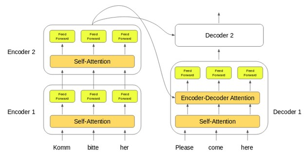

An important thing to note here – in addition to the self-attention and feed-forward layers, the decoders also have one more layer of Encoder-Decoder Attention layer. This helps the decoder focus on the appropriate parts of the input sequence.

__Self-Attention__

Self-attention, sometimes called intra-attention, is an attention mechanism relating different positions of a single sequence in order to compute a representation of the sequence.

Self-attention allows the model to look at the other words in the input sequence to get a better understanding of a certain word in the sequence.

__Calculating Self-Attention__

First, we need to create three vectors from each of the encoder’s input vectors:
1. Query Vector
2. Key Vector
3. Value Vector.

These vectors are trained and updated during the training process.

Next, we will calculate self-attention for every word in the input sequence.

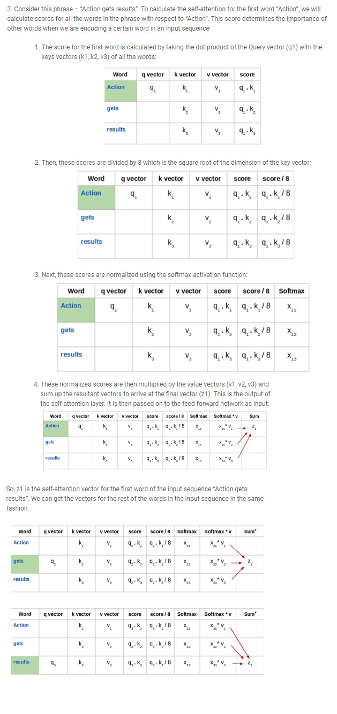

Self-attention is computed not once but multiple times in the Transformer’s architecture, in parallel and independently. It is therefore referred to as Multi-head Attention. The outputs are concatenated and linearly transformed as shown in the figure below:

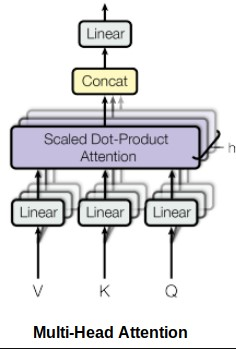

__Limitations of the Transformer__

Transformer is undoubtedly a huge improvement over the RNN based seq2seq models. But it comes with its own share of limitations:
- Attention can only deal with fixed-length text strings. The text has to be split into a certain number of segments or chunks before being fed into the system as input
- This chunking of text causes context fragmentation. For example, if a sentence is split from the middle, then a significant amount of context is lost. In other words, the text is split without respecting the sentence or any other semantic boundary

So how do we deal with these pretty major issues? That’s the question folks who worked with Transformer asked. And out of this came Transformer-XL.

__Understanding Transformer-XL__

In this architecture, the hidden states obtained in previous segments are reused as a source of information for the current segment. It enables modeling longer-term dependency as the information can flow from one segment to the next.

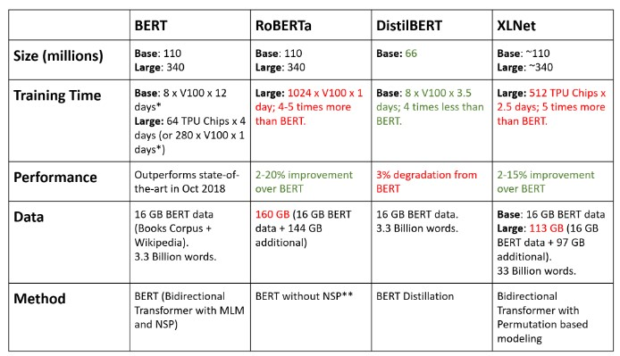

<h2>General</h2>

Document understanding goes over and above OCR, requiring layout analysis, handwritten text recognition, symbolic language interpretation etc., on anything from administrative and historical documents to mixed-type documents such as maps and diagrams. Understanding text in the wild, on the other hand, has already enabled applications such as image-based translation or autonomous navigation.

Cloud computing, in general, is also gaining more attention as a cost issue to be addressed by software companies. Tightly coupling an application to the current way of doing things may lead to an architectural disadvantage in the future.

On one hand, ops groups are in a good position to do this; they’re already heavily invested in testing, monitoring, version control, reproducibility, and automation. On the other hand, they will have to learn a lot about how AI applications work and what’s needed to support them. There’s a lot more to AI Operations than Kubernetes and Docker.

Source code is relatively less important compared to typical applications; the training data is what determines how the model behaves, and the training process is all about tweaking parameters in the application so that it delivers correct results most of the time.

This means that, to have a history of how an application was developed, you have to look at more than the source code. You need a repository for models and for the training data. There are many tools for managing source code, from git back to the venerable SCCS, but we’re only starting to build tools for data versioning. And that’s essential: if you need to understand how your model behaves, and you don’t have the training data, you’re sunk. The same is true for the models themselves; if you don’t have the artifacts you produced, you won’t be able to make statements about how they performed. Given source code and the training data, you could re-produce a model, but it almost certainly wouldn’t be the same because of randomization in the training process.

This changes what we mean by “monitoring.” AI applications need to be monitored for staleness—whatever that might mean for your particular application. They also need to be monitored for fairness and bias, which can certainly creep in after deployment. And these results are inherently statistical. You need to collect a large number of data points to tell that a model has grown stale. It’s not like pinging a server to see if it’s down; it’s more like analyzing long-term trends in response time. We have the tools for that analysis; we just need to learn how to re-deploy them around issues like fairness.

Last, and maybe most important: AI applications are, above all, probabilistic. Given the same inputs, they don’t necessarily return the same results each time. This has important implications for testing. We can do unit testing, integration testing, and acceptance testing—but we have to acknowledge that AI is not a world in which testing whether 2 == 1+1 counts for much. And conversely, if you need software with that kind of accuracy (for example, a billing application), you shouldn’t be using AI. In the last two decades, a tremendous amount of work has been done on testing and building test suites. Now, it looks like that’s just a start. How do we test software whose behavior is fundamentally probabilistic? We will need to learn.

<h2>Courses</h2>

<h3>LinkedIn: Deploying Scalable Machine Learning for Data Science</h3>

__The Need to Scale ML Models__

_What to consider:_

- Deploying code to servers
- Ensuring continuous availability
- Programmatic access (APIs)
- Access controls
- Scalability

When we run a model in production we have to consider how will we persist the model and distribute it to servers running the predictive models?
- We can use language specific serialization like Pickle. This method takes a structure form a running instance of Python and stores it in a way that is easily loaded into a python instance.
- Or you can use the Predictive Model Markup Language, an XML Markup Language if you want the model to run on different platforms.

Once the model is developed, you need to treat it like any other software, it should have:
- Version Control
- Testing
- Security

_Update Model_

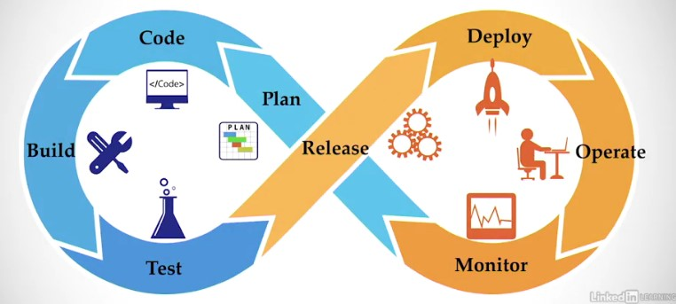

_Canary Deploy_: is deploying a new model to a subset of users and measure out how it performs and then decide whether to deploy it to all users or not.

_Blue / Green Deploy_: is where you create two active and idle environment where you have the current users in the active environment and you deploy the new product in the idle environment and then test out how it performs and then if all is well, move the users to the idle environment.

_Scalability_

A scalable system can use additional resources when the load on the system increases and downsize the resources when the load on the system decreases.

This kind of auto scaling is enabled by _load balancers_ and other software that can detect load on a system, and then adjust the number of servers in a cluster to match the demand.

_Auto-scaling Constraints_

To prevent your system from turning off servers the moment the load decreases and turning it back on when it increases, you can follow the following principles:
- Avoid thrashing
- Set thresholds for CPU Utilization
- Consider how long the threshold is exceeded

_Continuously available_

You can't always prevent failure and these can be beyond your control so what you can use is _redundancy_. You can have a cluster of servers ready to respond to API calls if one of the servers goes down and if a whole lot of clusters go down, you can use auto scaling to add more resources to your system. These two working together can help to keep your application responsive.

_Tools for Scaling Machine Learning Models_

It's clear that running machine learning models on clusters of servers has its advantages when we want to deploy a scalable, highly available system. But how do we deploy our models to these multiple machines, especially when we're adding and removing servers depending on demand?

We use the design pattern used to deploy microservices.
- Deploy the model with an API
- Run the model and API in a container
- Manage the containers using an orchestration service

_RESTful API_

The REST interface is a commonly used protocol for calling services over HTTP and having the results returned, typically in a JSON data structure.

For Python, we'll use Flask, a lightweight web development framework. Some other choices include Django, Pyramid, TurboGears, Web2py, and Bottle.

_Containers_

Containerization avoids many of the potential installation problems. Containers are like lightweight virtual machines and docker is a widely used containerization platform.

A container is an executable image that includes an operating system, programming languages, libraries, and other tools needed to run your service.

We specify the contents of a container in a configuration file. The config file is then used by a build process to create the image which can be executed on servers. Docker includes software for registering images and making them available for download. During deployment we download the image we want from the registry and run it in one or more of the services in our cluster.

_Clusters_

To manage our clusters we can use Kubernetes. It provides a number of services:
- Horizontal scaling
- Optimized placement of containers
- Automated roll-outs of new versions of code
- Storage management
- Self healing

In summary there are three levels to scalability.
- Exposing the model through an API
- Putting the model and API in a container
- Managing containers with an orchestration platform

__Design Patterns for Scalable ML Applications__

_Vertical Scaling_: is a common practice when monolithic applications needed to run on a single server.

- Replace servers
- Increase number of CPUs
- More memory
- More storage

With vertical scaling, need to plan ahead for peak demand.

_Horizontal Scaling_: we add servers to the clusters when we need and we remove it when we don't.

- Add servers
- Running same software

With horizontal scaling, adapt to peak demand.

_Services_

- Accessible over network
- Invoked using standard protocols
- Perform a single function
- Deployed in parallel

Services can be distinguished by how they exchange data. For example, restful services often pass data in JSON structures. High-volume services sometimes use other protocols such as thrifts or protocol buffers.

When your service is running, it receives API calls through a web application server. If you deploy your model in Python you may use a web services gateway interface, commonly referred to as WSGI. Now a web service gateway interface runs in web server like Apache or Nginx. These are the applications that listen on the network ports and receive API requests. The request is then forwarded to your application, which in this case is our machine learning model.

_APIs for ML Model Services_

Restful APIs are invoked using HTTP commands and since we are working with HTTP, the commands will include a URL. For example if you have a URL, the command will make a call to the server at the URL and request whatever is available at the URL. When invoking an API call, we can use different HTTP commands:
- GET
- POST
- PUT
- DELETE

If I deploy the model, I would need to get a link to the model, let's say for the summarizer the link might look like "http://papyri.com/api/v01/summarizer". Note the api and v01 are best practices where v01 represents the model version.

As a dummy example from the lecture, if you want to pass parameters for the sepal classifier which has like sepal length width and stuff, you can construct an API with the parameters as: "http://scalablemodels.com/api/v01/classify?s1=5.1&sw=3.4" and the model will perform classification and return the "species" in a json format. Now in my case, my API call will be sending the json object, which has the arXiv link to the pdf and the title.

HTTP Result Codes:
- 200 - Success
- 400 - Bad Request
- 401 - Unauthorized
- 404 - Not Found

Another common practice when working with APIs is to pass in an API key. This is a unique string that identifies a user. These are used to control access to services, and in some cases track charges for making calls to service. I can use this to control how many requests a user can make for my app and I can generate the key based on the users IP.

_Load balancing and clusters of servers_

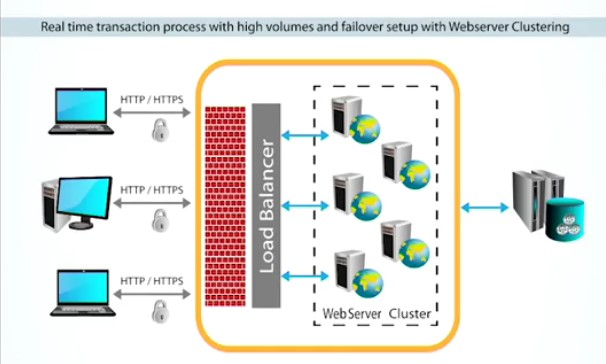

- Distribute work load
- Detect unhealthy servers
- Are configured for high availability
- Able to meet demand

There are several ways of load Balancing Methods:

- Client-side balancing: a list of IP addresses is delivered to the client and the client randomly chooses the OP address of a server in the cluster. One disadvantage is  that it requires a more complex client-side application

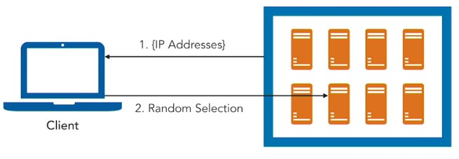

- Random choice: allows any server to be selected by load balancer for a service request. One way to randomly select is to simply generate a random number between one and the number of servers. Over time, random choice will distribute the load evenly across all servers.

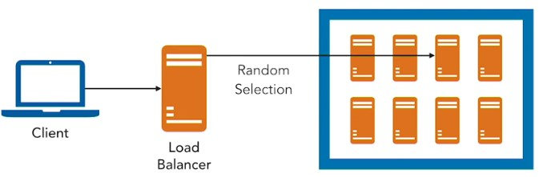

- Round-robin: the load balancer keeps track of which server was assigned the last request and when another request comes in, its sent to the next server in the list of servers. It has little overhead in terms of computing where to send the request but this is also its disadvantage because you can potentially send long running requests unevenly to different servers. This leads to uneven response time and inefficient use of cluster resources.

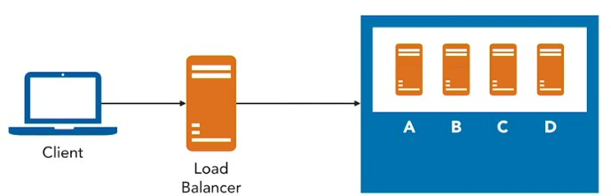

- Least connections: distributes the load based on the number of connections currently made to each server.

- Least load: takes into account CPU utilization or response time to determine the overall load on each server.

Load balancers can make application health check, provide HTTP compression, act as Firewall to prevent direct access to servers and act as intrusion detection and prevention services.

_Scaling horizontally with containers_

A virtual machine runs within a piece of software known as a hypervisor. Hypervisors run on top of operating systems known as the Host Operating System and runs other operating systems known as Guest Operating Systems.

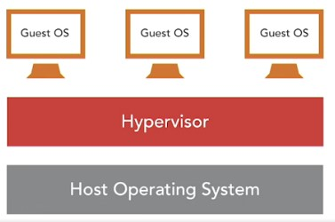

Containers are like virtual machines in that they let you run different guest OS but instead of using a hypervisor they use features of the Linux Operating System to isolate images running different operating systems. The linux features are control groups which allow containers to allocate CPU and memory resources and namespaces which allow linux to isolate and executing programs to access only resources within he same namespace.

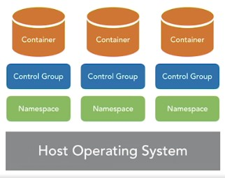

An image for a Machine Learning model will include:
- Base Operating System
- Programming languages
- Machine learning code
- Packages and libraries

To create and deploy:
- Specify the contents
- Execute image build
- Store image in repository
- Download image to server

If I am planning to have only a specific set of servers, I can install things manually but if I expect a varying load, I can use Kubernetes, they will manage the installation, take care of scaling and check if the containers are healthy.

__Deploying ML Models as Services__

_Services encapsulate ML models_

A service is an abstraction we can use to expose only the interface and hide the implementation details and communicate either using an HTTP or a json structure.

_Using Flask to create APIs for Python programs_

- Decorate python programs
- Instructions for creating API
- Decorator commands are preceded by @ sign

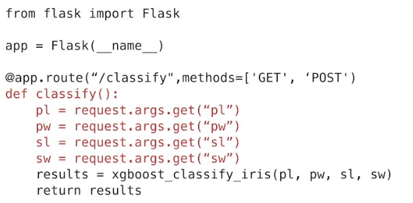

_Best practices for API design for ML services_

- Use a RESTful interface
- Use the GET or POST
- Document your API
- Name endpoints with informative names

__Running ML Services in Containers__

_Introduction to Docker_

Docker Components:
- Docker Engine- is an application that runs Docker images and includes a rest API and CLI
- Docker Client- is a set of programs for interacting with other Docker components
- Docker registry- is used to store and distribute Docker images.

- An image is a binary file containing resources needed to execute.
- An instance is an executing container.

_Building Docker images with Dockerfiles_

Start with a dockerfile and fill it with commands on how to run the program and when you execute the dockerfile, it produces the docker image.

__Scaling ML Services with Kubernetes__

_Running services in clusters_

Orchestration Platforms:
- Kubernetes
- Docker Swarm
- Mesos and Marathon

_Introduction to Kubernetes_

Kubernetes provide core management services that streamline the management of mid-to-large size clusters. Kubernetes uses two types of nodes, masters and minions.

- Master: is a single node that responds to API calls, manages workloads and tracks information about the state of the cluster. It runs several components:
    - Kube-API server: which manages the Kubernetes API,
    - Etcd: which is a high availability key value store for maintaining cluster data,
    - Kube scheduler: is a program that distributes pods to different nodes,
    - Kube controller manager: is a binary that controls nodes, replication process, endpoints, as well as service accounts,
    - Cloud controller manager: runs code that interacts with cloud services.

- Minion: are servers that run containers. It runs:
    - Kublet: which is an agent for making sure containers are running inside a pod,
    - Kube proxy: is used for managing network operations,
    - Container runtime: is the process that manages the execution of containers.

Within a minion there can be multiple containers working together to perform a single task. In my case I will have a container for my app and another container for my machine learning models.

Kubernetes uses an abstraction called pods. Pods describe containers that work together to perform a task. Pods have a single IP address and can be thought of as a higher level of abstraction than a container. This helps to map business functions to pods. This also allows us to map software functions like feature lookup or executing machine learning model to containers.

Kubernetes also has an abstraction for grouping pods into what it calls services where the group of pods perform the same task.

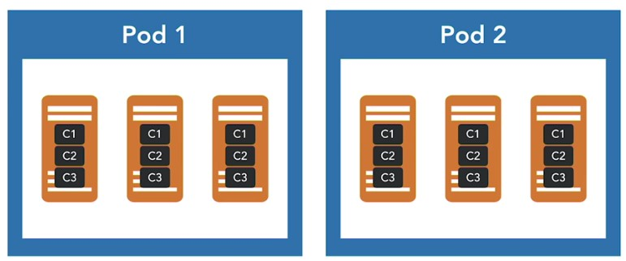

Kubernetes services have a load balancer to distribute workload across the pods. Kubernetes has other components as well. One example is the Web UI dashboard which is used for monitoring the state of the cluster.

_Auto-scaling a Kubernetes cluster_

Autoscale allows to autoscale kubernetes clusters based on cpu percent utilization and specify a min and max parameters.

__ML Services in Production__

_Monitoring service performance_

Scaling machine learning models requires that we employ DevOps practices to ensure that our applications are running as expected.

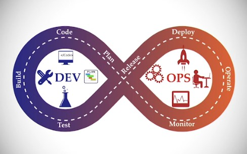

We monitor baseline performance and unusual events.

Three monitoring domains:
- Services
- Containers
- Cluster

_Service performance data_

We want to collect performance data and the number of errors occurred and also collect quality control data such as the parameter values sent in a call to the model and the results returned by the model. We can use that information to compare the current model to other possible models that we might wanna deploy.

Performance data can be collected using logging.

We can also use application performance monitoring tools to monitor baseline performance and custom events.

_Docker container monitoring_

The type of information we want to collect from the docker include:
- CPU utilization,
- Memory utilization,
- Disk performance information, which includes both the rate of IO block information and disk utilization
- Monitor the network and understand the level of IO traffic on the network.

We can get this using the docker stats command. It provides a live stream of usage statistics in the form of metrics, and the metrics cover the key things that we're interested in, the central processing unit utilization, memory utilization, network IO, and then block IO. Now one of the disadvantages of docker stats is that it's just a live stream. It doesn't persist the data. But there are third-party application monitoring tools which do persist the data.

_Kubernetes monitoring_

We need to monitor:
- Pods
- Core metrics
- Node problem detector

__Best practices for Scaling ML__

- Horizontal scaling
- Deploy models with APIs
- Use containers
- Use orchestration tools
- Monitor all levels of the stack.

<h3>Flask Essential Training</h3>

__Data Flow in Flask__

- I can use `redirect(url_for('home'))` to redirect url instead of `render_template`.
